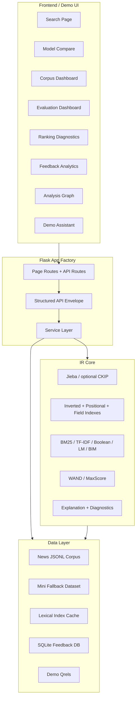
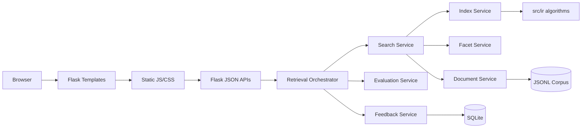
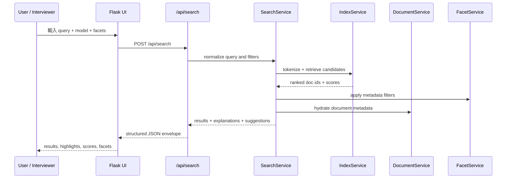
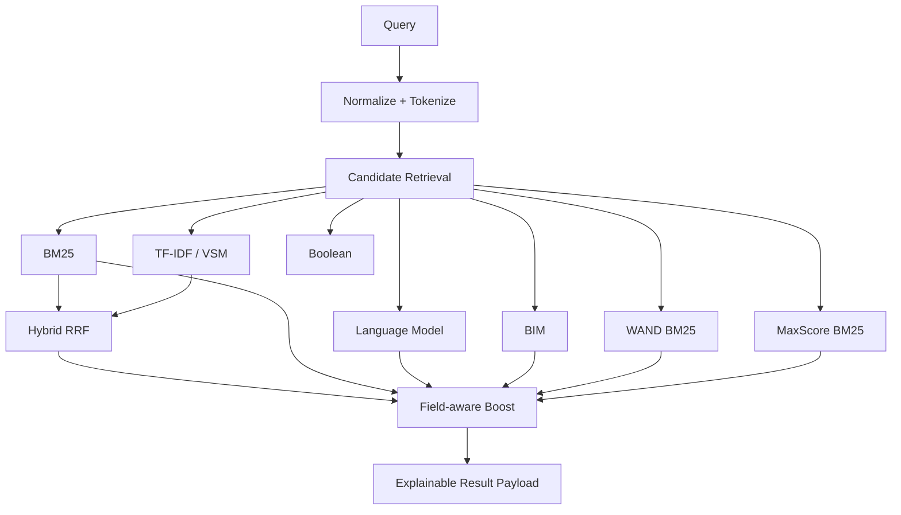
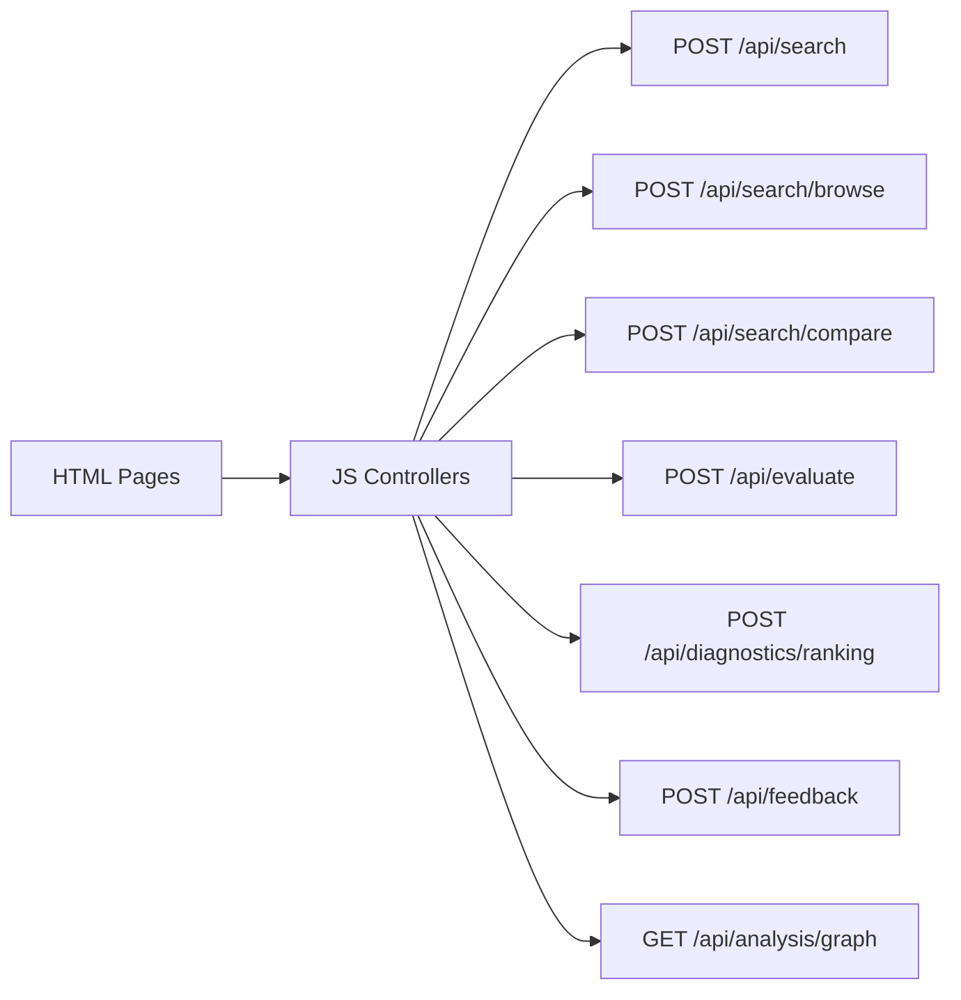
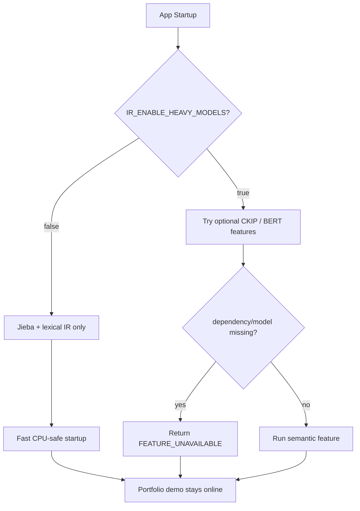
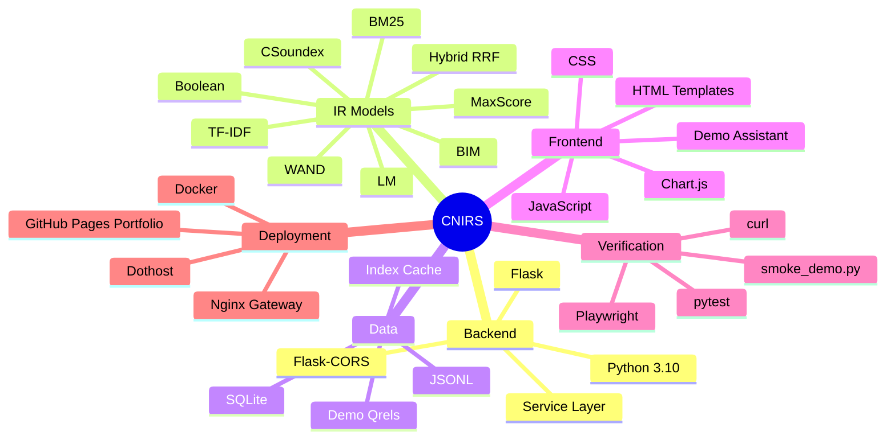

# CNIRS 中文新聞智能檢索系統

> Portfolio-ready Chinese News Intelligent Retrieval System.<br>
> 一個可搜尋、可解釋、可評估、可展示的中文新聞資訊檢索作品集專案。

[](#技術-stack)
[](#後端與-api)
[](#檢索與-ranking)
[](#公開展示)

## 公開展示

| 項目 | 連結 | 用途 |
| --- | --- | --- |
| Live Demo | <https://neojustin.dothost.net/projects/information-retrieval/> | 可互動 Flask 搜尋系統 |
| Portfolio Page | <https://justin21523.github.io/zh-TW/projects/information-retrieval/> | 面試官快速瀏覽的作品集頁 |
| Demo Video | [docs/assets/evaluation/cnirs-demo.webm](docs/assets/evaluation/cnirs-demo.webm) | 可錄影展示的完整操作流程 |
| Demo Guide | <https://neojustin.dothost.net/projects/information-retrieval/guide> | 五分鐘導覽腳本 |
| API Stats | <https://neojustin.dothost.net/projects/information-retrieval/api/stats> | 線上語料與索引健康檢查 |

第一屏不是行銷頁，而是直接呈現可操作的搜尋產品：查詢框、ranking model、facet sidebar、結果列表、分數、highlight、Why this result 與 Demo Assistant。


## 專案定位

CNIRS 的重點不是只展示單一演算法，而是把課堂型資訊檢索模組整理成一個完整 Search Engine Demo。面試官可以直接看到：

- 中文新聞查詢、metadata facet browsing、ranking model 切換。
- BM25、TF-IDF、Boolean、Hybrid RRF、Language Model、BIM、WAND、MaxScore、Fuzzy、CSoundex。
- 每筆結果的 snippet、highlight、component scores、field boosts、matched terms。
- Document detail 的 summary、KWIC、keywords、taxonomy、related news。
- Model Comparison、Evaluation Dashboard、Ranking Diagnostics、Feedback Analytics、Analysis Graph。
- 無 GPU、無外部模型、無第三方 API 時仍可啟動的 mock-safe / lightweight demo mode。

## 面試官應看的亮點

| 亮點 | 面試可觀察能力 | 對應畫面 |
| --- | --- | --- |
| 多模型檢索 | IR model integration、ranking API design | Search / Compare |
| 可解釋結果 | ranking diagnostics、feature attribution | Why this result / Diagnostics |
| Faceted Search | metadata cleaning、taxonomy、exploratory search | Search / Corpus |
| Evaluation Dashboard | qrels、Precision@K、Recall@K、MAP、MRR、nDCG | Evaluation |
| Feedback Analytics | click logs、relevance labels、LTR feature sandbox | Feedback |
| Analysis Graph | pipeline visualization、system explanation | Analysis Graph |
| Demo Assistant | portfolio UX、guided walkthrough、recordable flow | Guide / all pages |

## Demo 操作流程

```mermaid
flowchart LR
    A[打開 Live Demo] --> B[Hybrid 搜尋: 半導體 人工智慧]
    B --> C[套用 Facets: source / topic / date / tags]
    C --> D[打開 Why this result]
    D --> E[打開 Document Detail]
    E --> F[Compare: BM25 / TF-IDF / Hybrid / LM / BIM / WAND / MaxScore]
    F --> G[Corpus Dashboard + Topic Explorer]
    G --> H[Evaluation Dashboard]
    H --> I[Ranking Diagnostics]
    I --> J[Feedback Analytics + LTR Sandbox]
    J --> K[Analysis Graph 總結資料流]
```



建議五分鐘展示腳本：

1. 開啟 <https://neojustin.dothost.net/projects/information-retrieval/guide>。
2. 點「開始小幫手導覽」，跟著 Demo Assistant 逐步切換頁面。
3. 在主搜尋頁搜尋 `半導體 人工智慧`，模型選 `Hybrid`。
4. 展示左側 facets 如何不用改 query 就縮小結果。
5. 展開第一筆結果的 Why this result，說明 matched terms、field boost、BM25/TF-IDF component scores。
6. 開啟 Document Detail，展示 summary、KWIC、keywords、related news。
7. 切到 Compare、Evaluation、Diagnostics、Feedback、Analysis Graph，快速說明 IR 系統如何被評估與改善。

## 系統總覽



## 架構分層



| Layer | 主要責任 | 代表檔案 |
| --- | --- | --- |
| Page UI | 可展示頁面、操作流程、截圖狀態 | `templates/`, `static/js/`, `static/css/` |
| API | 統一 JSON response、錯誤格式、demo endpoints | `src/ir_app/app_factory.py`, `src/ir_app/schemas/` |
| Service | 搜尋、facet、文件詳情、評估、回饋、診斷 | `src/ir_app/services/` |
| IR Core | 演算法實作與可測模組 | `src/ir/` |
| Data | JSONL corpus、qrels、index cache、feedback logs | `data/`, `datasets/` |
| Demo Ops | smoke test、Playwright 截圖錄影、Docker | `scripts/smoke_demo.py`, `scripts/verify_ui_playwright.py`, `Dockerfile` |

## 資料流



## 檢索與 Ranking



| Model | Demo 狀態 | 說明 |
| --- | --- | --- |
| BM25 | Ready | 主要 lexical ranking baseline |
| TF-IDF / VSM | Ready | cosine similarity baseline |
| Boolean | Ready | AND / OR / NOT、phrase、field-aware syntax |
| Hybrid RRF | Ready | BM25 + TF-IDF reciprocal-rank fusion |
| LM | Ready | query likelihood language model |
| BIM | Ready | Binary Independence Model |
| WAND BM25 | Ready | optimized top-k retrieval demonstration |
| MaxScore BM25 | Ready | optimized top-k retrieval demonstration |
| Fuzzy / CSoundex | Ready | 中文容錯與音近字探索 |
| BERT / CKIP heavy models | Optional disabled | demo-safe mode 回傳 structured unavailable，不讓服務崩潰 |

## 後端與 API



| Endpoint | 用途 |
| --- | --- |
| `GET /api/stats` | corpus、index、model readiness |
| `POST /api/search` | query search + explanations |
| `POST /api/search/browse` | 無 query 的 facet browsing |
| `POST /api/search/compare` | 多模型 ranking comparison |
| `GET /api/all_facets` | facet metadata + quality |
| `GET /api/document/<doc_id>` | summary、KWIC、keywords、related docs |
| `POST /api/evaluate` | demo qrels metrics |
| `POST /api/diagnostics/ranking` | term contribution and score breakdown |
| `GET /api/feedback/analytics` | click/relevance/zero-result analytics |
| `POST /api/ltr/train` | weak-supervision LTR sandbox |
| `GET /api/analysis/graph` | IR pipeline node graph |

## Mock-safe Demo Mode



Runtime defaults:

| Variable | Default | Purpose |
| --- | --- | --- |
| `IR_ENABLE_HEAVY_MODELS` | `false` | Disable CKIP/BERT-style startup risk |
| `IR_TOKENIZER_ENGINE` | `jieba` | CPU-safe tokenizer |
| `IR_DATASET_PATH` | first available prepared JSONL | Main corpus |
| `IR_FALLBACK_DATASET_PATH` | `datasets/mini/ir_documents.json` | Small deterministic fallback |
| `IR_INDEX_DIR` | `data/indexes` | persistent lexical index cache |
| `IR_MAX_DOCUMENTS` | `25000` | startup document cap |
| `IR_HOST` / `IR_PORT` | `0.0.0.0` / `5001` | Flask bind settings |

## 部署架構

```mermaid
flowchart LR
    Dev[Local Repo] --> GitHub[GitHub Repo]
    GitHub --> Dothost[Dothost Docker Compose]
    Dothost --> Gateway[Nginx Portfolio Gateway]
    Gateway --> Live[Live Flask Demo /projects/information-retrieval/]

    Dev --> PortfolioRepo[justin-portfolio Repo]
    PortfolioRepo --> Actions[GitHub Actions]
    Actions --> Pages[GitHub Pages Static Export]
    Pages --> CaseStudy[Portfolio Case Study Page]

    Live --> APIStats[/api/stats]
    CaseStudy --> Media[cover + screenshots + webm]
```

GitHub Pages 適合展示 portfolio case study、截圖和影片；不適合直接執行 Flask API。因此本專案採用雙路徑：

- `neojustin.dothost.net/projects/information-retrieval/`: dynamic Flask demo。
- `justin21523.github.io/zh-TW/projects/information-retrieval/`: static portfolio page with media。

## 快速啟動

```bash
pip install -r requirements.txt
IR_ENABLE_HEAVY_MODELS=false python app.py
```

Open:

- Local: <http://localhost:5001/>
- Guide: <http://localhost:5001/guide>
- Stats: <http://localhost:5001/api/stats>

建議 demo query:

```text
半導體 人工智慧
台灣 經濟
美國 中國
```

## Smoke Test

本機 Flask test client:

```bash
python scripts/smoke_demo.py
```

公開 demo:

```bash
python scripts/smoke_demo.py --base-url https://neojustin.dothost.net/projects/information-retrieval
```

手動 curl:

```bash
curl -I http://127.0.0.1:5001/
curl -s http://127.0.0.1:5001/api/stats | python -m json.tool | head
curl -s -H "Content-Type: application/json" \
  -d '{"query":"半導體 人工智慧","model":"hybrid","top_k":3}' \
  http://127.0.0.1:5001/api/search | python -m json.tool | head
```

## 測試與驗證

| Command | 目的 | 目前用途 |
| --- | --- | --- |
| `python -m pytest tests/test_ir_app_api.py tests/test_ir_app_text_quality.py -q` | Web/API demo regression | demo 必跑 |
| `python -m pytest -m "not slow" -q` | fast suite | release 前必跑 |
| `python scripts/smoke_demo.py` | local smoke | demo 必跑 |
| `python scripts/smoke_demo.py --base-url ...` | deployed smoke | deploy 後必跑 |
| `python scripts/verify_ui_playwright.py` | 截圖與 WebM 錄影 | media 更新時執行 |
| `black --check ...` / `flake8 ...` / `mypy ...` | code quality audit | 目前有 legacy debt，需分階段清理 |

目前已知品質狀態：

- Demo/API smoke 可通過。
- Fast pytest suite 可通過。
- 全 repo `black --check`、`flake8`、`mypy` 有大量既有舊債，不在 portfolio hardening commit 中做大規模格式化，以免混入不相關變更。

## Demo Media

Playwright 腳本會將可截圖狀態與錄影輸出到 `docs/assets/evaluation/`。

```bash
python scripts/verify_ui_playwright.py
```

主要資產：

| Asset | 說明 |
| --- | --- |
| [search-results.png](docs/assets/evaluation/search-results.png) | 主搜尋頁、facets、結果與小幫手 |
| [facet-browse.png](docs/assets/evaluation/facet-browse.png) | 無 query 的 metadata browsing |
| [document-detail.png](docs/assets/evaluation/document-detail.png) | 文章詳情 modal |
| [model-compare.png](docs/assets/evaluation/model-compare.png) | 多模型比較 |
| [corpus-dashboard.png](docs/assets/evaluation/corpus-dashboard.png) | 語料庫與 metadata dashboard |
| [evaluation-dashboard.png](docs/assets/evaluation/evaluation-dashboard.png) | qrels evaluation |
| [ranking-diagnostics.png](docs/assets/evaluation/ranking-diagnostics.png) | 排序診斷 |
| [analysis-graph.png](docs/assets/evaluation/analysis-graph.png) | IR pipeline graph |
| [feedback-analytics.png](docs/assets/evaluation/feedback-analytics.png) | feedback + LTR sandbox |
| [cnirs-demo.webm](docs/assets/evaluation/cnirs-demo.webm) | 完整 demo recording |

## 技術 Stack



## 專案檔案與資料夾結構

```text
information-retrieval/
├── app.py
├── app_simple.py
├── requirements.txt
├── Dockerfile
├── docker-compose.yml
├── DEPLOYMENT.md
├── README.md
├── configs/
│   ├── csoundex.yaml
│   └── logging.yaml
├── data/
│   ├── evaluation/
│   │   ├── demo_qrels.json
│   │   ├── qrels.txt
│   │   └── test_queries.txt
│   ├── processed/
│   │   └── cna_mvp_cleaned.jsonl
│   ├── preprocessed/
│   │   └── cna_mvp_preprocessed.jsonl
│   ├── raw/
│   ├── stats/
│   └── indexes/
├── datasets/
│   ├── mini/
│   │   ├── ir_documents.json
│   │   ├── sample_qrels.json
│   │   └── sample_results.json
│   ├── lexicon/
│   └── stopwords/
├── docs/
│   ├── assets/evaluation/
│   ├── guides/
│   ├── project/
│   ├── reports/
│   └── CHANGELOG.md
├── scripts/
│   ├── smoke_demo.py
│   ├── verify_ui_playwright.py
│   ├── boolean_search.py
│   ├── vsm_search.py
│   ├── eval_run.py
│   ├── build_indexes.py
│   ├── crawlers/
│   └── data/
├── src/
│   ├── ir/
│   │   ├── text/
│   │   ├── index/
│   │   ├── retrieval/
│   │   ├── ranking/
│   │   ├── eval/
│   │   ├── facet/
│   │   ├── cluster/
│   │   ├── summarize/
│   │   ├── keyextract/
│   │   ├── semantic/
│   │   └── topic/
│   ├── ir_app/
│   │   ├── app_factory.py
│   │   ├── config/
│   │   ├── schemas/
│   │   └── services/
│   └── database/
├── static/
│   ├── css/
│   └── js/
├── templates/
└── tests/
```

| Path | 主要功能 |
| --- | --- |
| `app.py` | Flask demo entrypoint，呼叫 `src.ir_app.app_factory.run()` |
| `src/ir_app/app_factory.py` | 建立 Flask app、註冊頁面 route 和 API route |
| `src/ir_app/config/settings.py` | runtime env settings、dataset fallback、heavy model toggle |
| `src/ir_app/schemas/` | API response envelope 和 search result schema |
| `src/ir_app/services/document_service.py` | 載入 JSONL/mini dataset、正規化 metadata、doc lookup |
| `src/ir_app/services/search_service.py` | 統一 search API、model dispatch、snippet、highlight、explanation |
| `src/ir_app/services/index_service.py` | tokenizer、inverted index、TF-IDF、BM25 cache |
| `src/ir_app/services/facet_service.py` | metadata facet counts、quality、browse filters |
| `src/ir_app/services/document_detail_service.py` | summary、KWIC、keywords、related documents |
| `src/ir_app/services/evaluation_service.py` | demo qrels metrics、per-query breakdown |
| `src/ir_app/services/ranking_diagnostics_service.py` | BM25/TF-IDF/LM term contribution diagnostics |
| `src/ir_app/services/feedback_service.py` | SQLite feedback event storage |
| `src/ir_app/services/feedback_analytics_service.py` | CTR、zero-result、duplicates、quality controls |
| `src/ir_app/services/learning_to_rank_*` | weak-supervision LTR feature preview and sandbox training |
| `src/ir/` | reusable IR algorithms used by tests, CLI, and app service layer |
| `templates/search.html` | 主搜尋 UI，第一屏展示產品本體 |
| `templates/guide.html` | 面試 demo walkthrough |
| `templates/compare.html` | model comparison UI |
| `templates/corpus.html` | corpus readiness、topic explorer |
| `templates/evaluation.html` | qrels evaluation dashboard |
| `templates/diagnostics.html` | ranking diagnostics dashboard |
| `templates/feedback.html` | feedback analytics and LTR sandbox |
| `templates/analysis_graph.html` | node-based IR pipeline visualization |
| `static/js/demo-assistant.js` | guided portfolio tour and screenshot-ready states |
| `static/js/search.js` | main search interaction |
| `static/js/facet.js` | facet loading, filtering, browse mode |
| `static/js/document-modal.js` | document detail modal |
| `static/js/evaluation.js` | evaluation dashboard client |
| `static/js/diagnostics.js` | ranking diagnostics client |
| `static/js/feedback-analytics.js` | feedback dashboard client |
| `static/js/analysis-graph.js` | analysis graph rendering |
| `data/processed/cna_mvp_cleaned.jsonl` | small tracked news corpus for local demo |
| `datasets/mini/ir_documents.json` | deterministic mini fallback for tests |
| `data/evaluation/demo_qrels.json` | curated demo relevance judgments |
| `docs/assets/evaluation/` | screenshots and WebM demo video |
| `scripts/smoke_demo.py` | local/remote portfolio smoke checks |
| `scripts/verify_ui_playwright.py` | screenshot and video generation |
| `Dockerfile` | production container for dothost Flask deployment |

## 已完成功能

- Unified Flask demo app with page routes and structured JSON APIs.
- Search modes: BM25, TF-IDF, Boolean, Hybrid, LM, BIM, WAND, MaxScore, fuzzy, CSoundex.
- Faceted filtering and facet-only browse mode.
- Result explanation, field boost, component scores, snippets and highlights.
- Document detail enrichment: summary, KWIC, keywords, taxonomy, related documents.
- Corpus dashboard: source/topic/content-type distribution, metadata completeness, index cache.
- Topic explorer and clustering cards.
- Evaluation dashboard with demo qrels, PR curve data, per-query metrics.
- Ranking diagnostics with term contribution and field match matrix.
- Feedback analytics with click/relevance logs, quality controls and LTR sandbox.
- Analysis graph that visualizes query-processing-ranking-document-feedback flow.
- Demo assistant for guided walkthrough and reproducible screenshot states.
- Playwright screenshot and video generation.
- Docker deployment behind portfolio nginx gateway.

## 缺失與風險

| 風險 | 現況 | 緩解方式 |
| --- | --- | --- |
| Full benchmark 不完整 | qrels 是 demo-scale，不是假裝正式 benchmark | UI 和 README 明確標示 demo evaluation |
| Heavy semantic models | CKIP/BERT/BERTopic/FAISS 可能缺權重或資源 | default disabled，回傳 structured unavailable |
| Full repo lint/type debt | 舊研究模組有 black/flake8/mypy debt | portfolio commit 不混入大規模格式化，另開 cleanup |
| Public Flask hosting | GitHub Pages 不能跑 Flask | dynamic demo 放 dothost，static portfolio 放 GitHub Pages |
| Corpus size差異 | local tracked corpus 較小，server corpus 較完整 | README 註明 fallback，API stats 可直接驗證 |

## Portfolio 整合

主 portfolio repo:

```text
/home/justin/web-projects/justin-portfolio/
├── content/projects/information-retrieval/
│   ├── zh-TW.md
│   ├── en.md
│   └── project.override.json
└── public/portfolio/projects/information-retrieval/
    ├── cover.png
    ├── demo/cnirs-demo.webm
    └── screenshots/
```

Portfolio build:

```bash
cd /home/justin/web-projects/justin-portfolio
npm ci
npm run catalog:validate
npm run lint
npm run typecheck
npm run build
```

Public asset verification:

```bash
curl -I https://justin21523.github.io/zh-TW/projects/information-retrieval/
curl -I https://justin21523.github.io/portfolio/projects/information-retrieval/cover.png
curl -I https://justin21523.github.io/portfolio/projects/information-retrieval/demo/cnirs-demo.webm
```

## 本機開發指令

```bash
# install
pip install -r requirements.txt

# run app
IR_ENABLE_HEAVY_MODELS=false python app.py

# app/API tests
python -m pytest tests/test_ir_app_api.py tests/test_ir_app_text_quality.py -q

# fast suite
python -m pytest -m "not slow" -q

# smoke checks
python scripts/smoke_demo.py

# generate screenshots/video
python scripts/verify_ui_playwright.py
```

## CLI 範例

```bash
python scripts/boolean_search.py --query "information AND retrieval"
python scripts/vsm_search.py --query "machine learning" --topk 10
python scripts/eval_run.py --results results.json --qrels qrels.txt --metrics MAP,nDCG,P@10
python scripts/csoundex_encode.py --text "三聚氰胺"
```

## 專案價值總結

CNIRS 展示的是一個完整資訊檢索系統的工程整理能力：從資料清理、索引、ranking、facets、explanation、evaluation、feedback、UI demo、media packaging 到部署驗證。它適合用在面試中說明如何把研究型或課堂型演算法模組，整理成面試官能直接操作、截圖、錄影並快速理解的 portfolio project。

## License

This project is for educational and portfolio demonstration purposes. Core IR concepts reference *Introduction to Information Retrieval* by Manning, Raghavan, and Schuetze.
