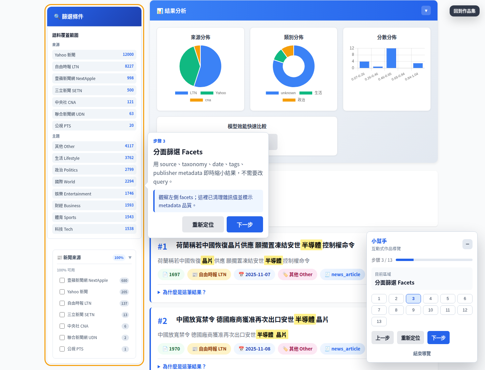
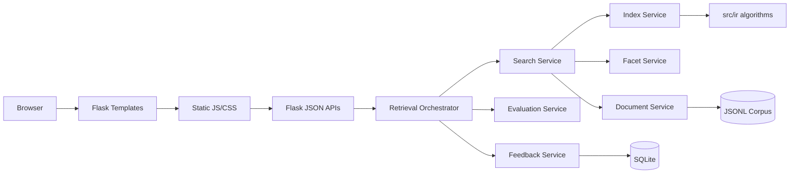
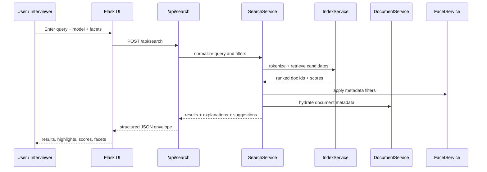
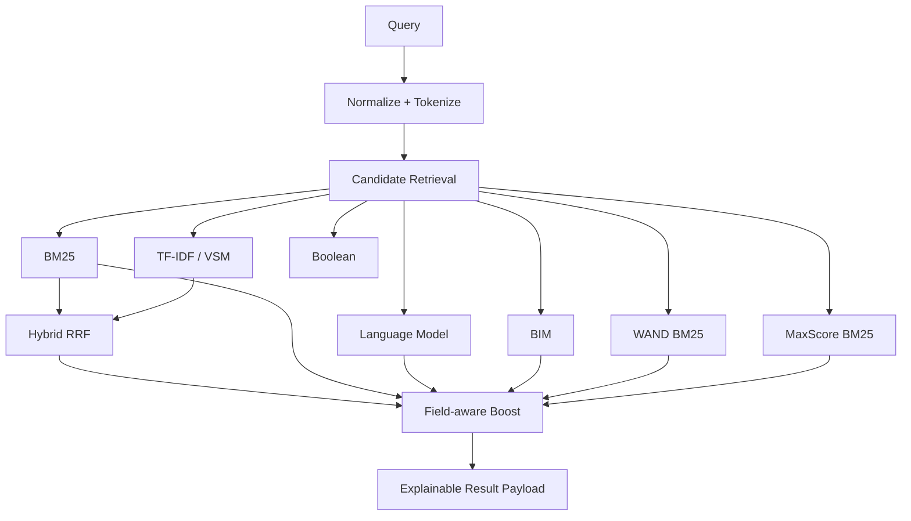
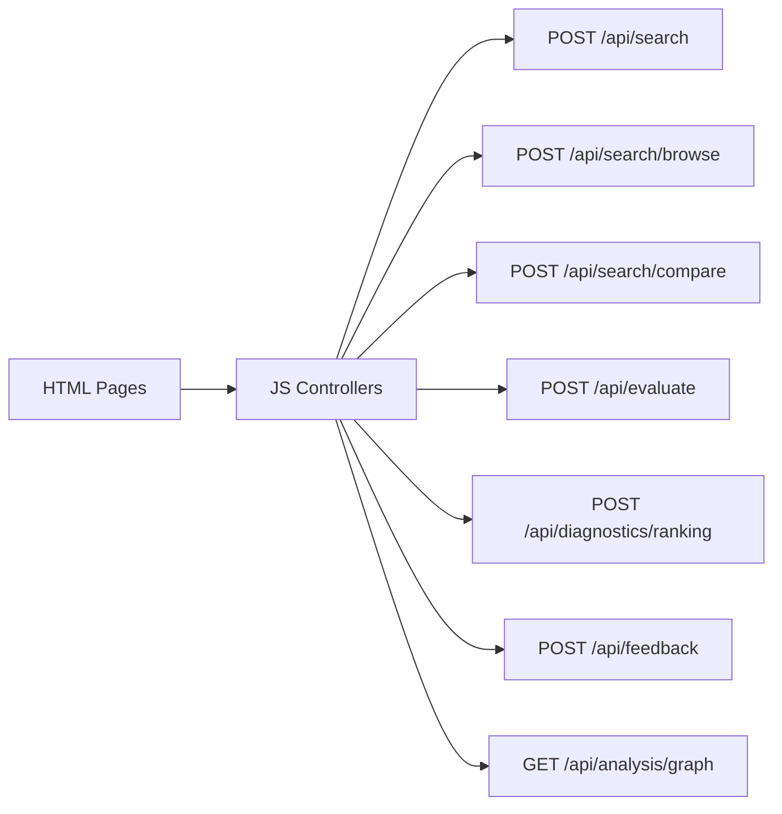
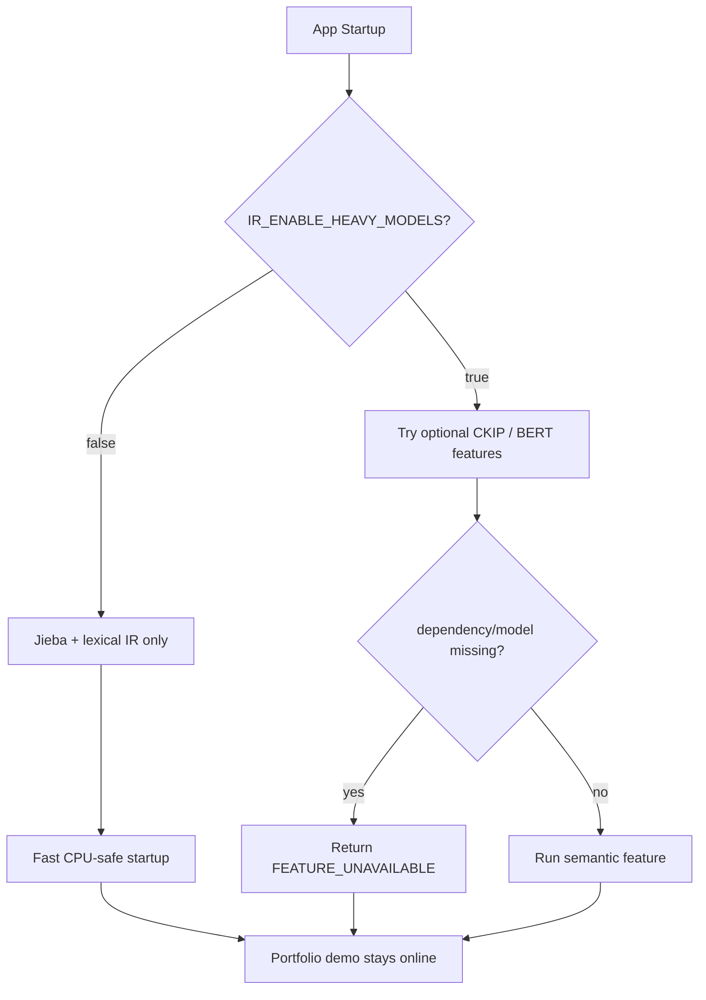
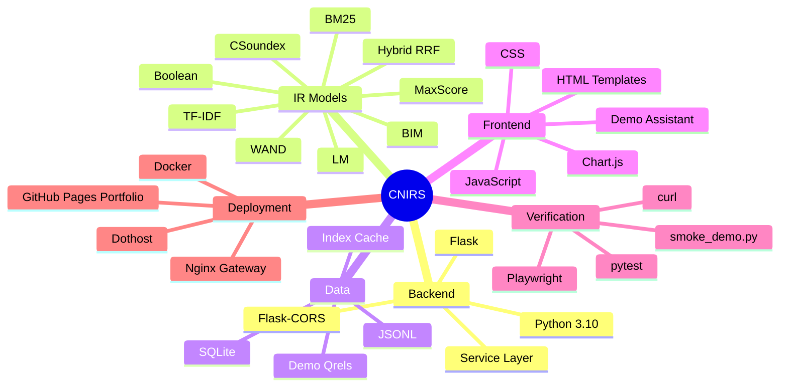

# CNIRS Chinese News Intelligent Retrieval System

> Portfolio-ready Chinese News Intelligent Retrieval System.<br>
> A searchable, explainable, evaluable, and demo-ready Chinese news information retrieval portfolio project.

[](#tech-stack)
[](#backend-and-api)
[](#retrieval-and-ranking)
[](#public-showcase)

## Public Showcase

| Item | Link | Purpose |
| --- | --- | --- |
| Live Demo | <https://neojustin.dothost.net/projects/information-retrieval/> | Interactive Flask search system |
| Portfolio Page | <https://justin21523.github.io/zh-TW/projects/information-retrieval/> | Portfolio page for quick interviewer review |
| Demo Video | [docs/assets/evaluation/cnirs-demo.webm](docs/assets/evaluation/cnirs-demo.webm) | Full operation flow for recorded demonstration |
| Demo Guide | <https://neojustin.dothost.net/projects/information-retrieval/guide> | Five-minute walkthrough script |
| API Stats | <https://neojustin.dothost.net/projects/information-retrieval/api/stats> | Online corpus and index health check |

The first screen is not a marketing landing page. It directly presents an operable search product: query box, ranking model, facet sidebar, result list, scores, highlights, Why this result, and Demo Assistant.



## Project Positioning

CNIRS is not focused on showcasing a single algorithm. Instead, it turns classroom-style information retrieval modules into a complete Search Engine Demo. Interviewers can directly observe:

- Chinese news search, metadata facet browsing, and ranking model switching.
- BM25, TF-IDF, Boolean, Hybrid RRF, Language Model, BIM, WAND, MaxScore, Fuzzy, and CSoundex.
- Snippets, highlights, component scores, field boosts, and matched terms for each result.
- Document detail with summary, KWIC, keywords, taxonomy, and related news.
- Model Comparison, Evaluation Dashboard, Ranking Diagnostics, Feedback Analytics, and Analysis Graph.
- A mock-safe / lightweight demo mode that can still start without GPU, external models, or third-party APIs.

## Highlights for Interviewers

| Highlight | Observable Interview Capability | Related Page |
| --- | --- | --- |
| Multi-model Retrieval | IR model integration, ranking API design | Search / Compare |
| Explainable Results | Ranking diagnostics, feature attribution | Why this result / Diagnostics |
| Faceted Search | Metadata cleaning, taxonomy, exploratory search | Search / Corpus |
| Evaluation Dashboard | qrels, Precision@K, Recall@K, MAP, MRR, nDCG | Evaluation |
| Feedback Analytics | Click logs, relevance labels, LTR feature sandbox | Feedback |
| Analysis Graph | Pipeline visualization, system explanation | Analysis Graph |
| Demo Assistant | Portfolio UX, guided walkthrough, recordable flow | Guide / all pages |

## Demo Operation Flow

```mermaid
flowchart LR
    A[Open Live Demo] --> B[Hybrid Search: semiconductors artificial intelligence]
    B --> C[Apply Facets: source / topic / date / tags]
    C --> D[Open Why this result]
    D --> E[Open Document Detail]
    E --> F[Compare: BM25 / TF-IDF / Hybrid / LM / BIM / WAND / MaxScore]
    F --> G[Corpus Dashboard + Topic Explorer]
    G --> H[Evaluation Dashboard]
    H --> I[Ranking Diagnostics]
    I --> J[Feedback Analytics + LTR Sandbox]
    J --> K[Analysis Graph summarizes the data flow]
````

Suggested five-minute demo script:

1. Open [https://neojustin.dothost.net/projects/information-retrieval/guide](https://neojustin.dothost.net/projects/information-retrieval/guide).
2. Click “Start Assistant Tour” and follow the Demo Assistant to switch pages step by step.
3. On the main search page, search for `半導體 人工智慧` and select the `Hybrid` model.
4. Demonstrate how the left-side facets narrow results without changing the query.
5. Expand Why this result for the first result and explain matched terms, field boost, and BM25/TF-IDF component scores.
6. Open Document Detail and demonstrate summary, KWIC, keywords, and related news.
7. Switch to Compare, Evaluation, Diagnostics, Feedback, and Analysis Graph to briefly explain how the IR system is evaluated and improved.

## System Overview

```mermaid
flowchart TB
    subgraph UI[Frontend / Demo UI]
        Search[Search Page]
        Compare[Model Compare]
        Corpus[Corpus Dashboard]
        Eval[Evaluation Dashboard]
        Diag[Ranking Diagnostics]
        Feedback[Feedback Analytics]
        Graph[Analysis Graph]
        Assistant[Demo Assistant]
    end

    subgraph Flask[Flask App Factory]
        Routes[Page Routes + API Routes]
        Schemas[Structured API Envelope]
        Services[Service Layer]
    end

    subgraph IR[IR Core]
        Tokenizer[Jieba / optional CKIP]
        Index[Inverted + Positional + Field Indexes]
        Rankers[BM25 / TF-IDF / Boolean / LM / BIM]
        Optimized[WAND / MaxScore]
        Explain[Explanation + Diagnostics]
    end

    subgraph Data[Data Layer]
        JSONL[News JSONL Corpus]
        Mini[Mini Fallback Dataset]
        Cache[Lexical Index Cache]
        SQLite[SQLite Feedback DB]
        Qrels[Demo Qrels]
    end

    UI --> Routes
    Routes --> Schemas
    Schemas --> Services
    Services --> IR
    Services --> Data
    IR --> Data
```

## Architecture Layers



| Layer    | Main Responsibility                                                 | Representative Files                                                     |
| -------- | ------------------------------------------------------------------- | ------------------------------------------------------------------------ |
| Page UI  | Demo-ready pages, operation flow, screenshot states                 | `templates/`, `static/js/`, `static/css/`                                |
| API      | Unified JSON responses, error format, demo endpoints                | `src/ir_app/app_factory.py`, `src/ir_app/schemas/`                       |
| Service  | Search, facets, document details, evaluation, feedback, diagnostics | `src/ir_app/services/`                                                   |
| IR Core  | Algorithm implementations and testable modules                      | `src/ir/`                                                                |
| Data     | JSONL corpus, qrels, index cache, feedback logs                     | `data/`, `datasets/`                                                     |
| Demo Ops | Smoke tests, Playwright screenshots and recording, Docker           | `scripts/smoke_demo.py`, `scripts/verify_ui_playwright.py`, `Dockerfile` |

## Data Flow



## Retrieval and Ranking



| Model                    | Demo Status       | Description                                                                   |
| ------------------------ | ----------------- | ----------------------------------------------------------------------------- |
| BM25                     | Ready             | Main lexical ranking baseline                                                 |
| TF-IDF / VSM             | Ready             | Cosine similarity baseline                                                    |
| Boolean                  | Ready             | AND / OR / NOT, phrase, field-aware syntax                                    |
| Hybrid RRF               | Ready             | BM25 + TF-IDF reciprocal-rank fusion                                          |
| LM                       | Ready             | Query likelihood language model                                               |
| BIM                      | Ready             | Binary Independence Model                                                     |
| WAND BM25                | Ready             | Optimized top-k retrieval demonstration                                       |
| MaxScore BM25            | Ready             | Optimized top-k retrieval demonstration                                       |
| Fuzzy / CSoundex         | Ready             | Chinese error tolerance and phonetic-similarity exploration                   |
| BERT / CKIP heavy models | Optional disabled | Demo-safe mode returns structured unavailable instead of crashing the service |

## Backend and API



| Endpoint                        | Purpose                               |
| ------------------------------- | ------------------------------------- |
| `GET /api/stats`                | Corpus, index, and model readiness    |
| `POST /api/search`              | Query search + explanations           |
| `POST /api/search/browse`       | Facet browsing without query          |
| `POST /api/search/compare`      | Multi-model ranking comparison        |
| `GET /api/all_facets`           | Facet metadata + quality              |
| `GET /api/document/<doc_id>`    | Summary, KWIC, keywords, related docs |
| `POST /api/evaluate`            | Demo qrels metrics                    |
| `POST /api/diagnostics/ranking` | Term contribution and score breakdown |
| `GET /api/feedback/analytics`   | Click/relevance/zero-result analytics |
| `POST /api/ltr/train`           | Weak-supervision LTR sandbox          |
| `GET /api/analysis/graph`       | IR pipeline node graph                |

## Mock-safe Demo Mode



Runtime defaults:

| Variable                   | Default                           | Purpose                              |
| -------------------------- | --------------------------------- | ------------------------------------ |
| `IR_ENABLE_HEAVY_MODELS`   | `false`                           | Disable CKIP/BERT-style startup risk |
| `IR_TOKENIZER_ENGINE`      | `jieba`                           | CPU-safe tokenizer                   |
| `IR_DATASET_PATH`          | first available prepared JSONL    | Main corpus                          |
| `IR_FALLBACK_DATASET_PATH` | `datasets/mini/ir_documents.json` | Small deterministic fallback         |
| `IR_INDEX_DIR`             | `data/indexes`                    | Persistent lexical index cache       |
| `IR_MAX_DOCUMENTS`         | `25000`                           | Startup document cap                 |
| `IR_HOST` / `IR_PORT`      | `0.0.0.0` / `5001`                | Flask bind settings                  |

## Deployment Architecture

```mermaid
flowchart LR
    Dev[Local Repo] --> GitHub[GitHub Repo]
    GitHub --> Dothost[Dothost Docker Compose]
    Dothost --> Gateway[Nginx Portfolio Gateway]
    Gateway --> Live[Live Flask Demo /projects/information-retrieval/]

    Dev --> PortfolioRepo[justin-portfolio Repo]
    PortfolioRepo --> Actions[GitHub Actions]
    Actions --> Pages[GitHub Pages Static Export]
    Pages --> CaseStudy[Portfolio Case Study Page]

    Live --> APIStats[/api/stats]
    CaseStudy --> Media[cover + screenshots + webm]
```

GitHub Pages is suitable for showcasing the portfolio case study, screenshots, and videos. It is not suitable for directly running Flask APIs. Therefore, this project uses a dual-path approach:

* `neojustin.dothost.net/projects/information-retrieval/`: dynamic Flask demo.
* `justin21523.github.io/zh-TW/projects/information-retrieval/`: static portfolio page with media.

## Quick Start

```bash
pip install -r requirements.txt
IR_ENABLE_HEAVY_MODELS=false python app.py
```

Open:

* Local: [http://localhost:5001/](http://localhost:5001/)
* Guide: [http://localhost:5001/guide](http://localhost:5001/guide)
* Stats: [http://localhost:5001/api/stats](http://localhost:5001/api/stats)

Suggested demo queries:

```text
半導體 人工智慧
台灣 經濟
美國 中國
```

## Smoke Test

Local Flask test client:

```bash
python scripts/smoke_demo.py
```

Public demo:

```bash
python scripts/smoke_demo.py --base-url https://neojustin.dothost.net/projects/information-retrieval
```

Manual curl:

```bash
curl -I http://127.0.0.1:5001/
curl -s http://127.0.0.1:5001/api/stats | python -m json.tool | head
curl -s -H "Content-Type: application/json" \
  -d '{"query":"半導體 人工智慧","model":"hybrid","top_k":3}' \
  http://127.0.0.1:5001/api/search | python -m json.tool | head
```

## Testing and Verification

| Command                                                                          | Purpose                        | Current Usage                                     |
| -------------------------------------------------------------------------------- | ------------------------------ | ------------------------------------------------- |
| `python -m pytest tests/test_ir_app_api.py tests/test_ir_app_text_quality.py -q` | Web/API demo regression        | Required for demo                                 |
| `python -m pytest -m "not slow" -q`                                              | Fast suite                     | Required before release                           |
| `python scripts/smoke_demo.py`                                                   | Local smoke                    | Required for demo                                 |
| `python scripts/smoke_demo.py --base-url ...`                                    | Deployed smoke                 | Required after deployment                         |
| `python scripts/verify_ui_playwright.py`                                         | Screenshots and WebM recording | Run when updating media                           |
| `black --check ...` / `flake8 ...` / `mypy ...`                                  | Code quality audit             | Existing legacy debt; should be cleaned in phases |

Current known quality status:

* Demo/API smoke tests pass.
* Fast pytest suite passes.
* Full-repo `black --check`, `flake8`, and `mypy` still have significant existing legacy debt. These are not mass-formatted in the portfolio hardening commit to avoid mixing unrelated changes.

## Demo Media

The Playwright script outputs screenshot-ready states and recordings to `docs/assets/evaluation/`.

```bash
python scripts/verify_ui_playwright.py
```

Main assets:

| Asset                                                                       | Description                                      |
| --------------------------------------------------------------------------- | ------------------------------------------------ |
| [search-results.png](docs/assets/evaluation/search-results.png)             | Main search page, facets, results, and assistant |
| [facet-browse.png](docs/assets/evaluation/facet-browse.png)                 | Metadata browsing without query                  |
| [document-detail.png](docs/assets/evaluation/document-detail.png)           | Article detail modal                             |
| [model-compare.png](docs/assets/evaluation/model-compare.png)               | Multi-model comparison                           |
| [corpus-dashboard.png](docs/assets/evaluation/corpus-dashboard.png)         | Corpus and metadata dashboard                    |
| [evaluation-dashboard.png](docs/assets/evaluation/evaluation-dashboard.png) | qrels evaluation                                 |
| [ranking-diagnostics.png](docs/assets/evaluation/ranking-diagnostics.png)   | Ranking diagnostics                              |
| [analysis-graph.png](docs/assets/evaluation/analysis-graph.png)             | IR pipeline graph                                |
| [feedback-analytics.png](docs/assets/evaluation/feedback-analytics.png)     | Feedback + LTR sandbox                           |
| [cnirs-demo.webm](docs/assets/evaluation/cnirs-demo.webm)                   | Full demo recording                              |

## Tech Stack



## Project Files and Folder Structure

```text
information-retrieval/
├── app.py
├── app_simple.py
├── requirements.txt
├── Dockerfile
├── docker-compose.yml
├── DEPLOYMENT.md
├── README.md
├── configs/
│   ├── csoundex.yaml
│   └── logging.yaml
├── data/
│   ├── evaluation/
│   │   ├── demo_qrels.json
│   │   ├── qrels.txt
│   │   └── test_queries.txt
│   ├── processed/
│   │   └── cna_mvp_cleaned.jsonl
│   ├── preprocessed/
│   │   └── cna_mvp_preprocessed.jsonl
│   ├── raw/
│   ├── stats/
│   └── indexes/
├── datasets/
│   ├── mini/
│   │   ├── ir_documents.json
│   │   ├── sample_qrels.json
│   │   └── sample_results.json
│   ├── lexicon/
│   └── stopwords/
├── docs/
│   ├── assets/evaluation/
│   ├── guides/
│   ├── project/
│   ├── reports/
│   └── CHANGELOG.md
├── scripts/
│   ├── smoke_demo.py
│   ├── verify_ui_playwright.py
│   ├── boolean_search.py
│   ├── vsm_search.py
│   ├── eval_run.py
│   ├── build_indexes.py
│   ├── crawlers/
│   └── data/
├── src/
│   ├── ir/
│   │   ├── text/
│   │   ├── index/
│   │   ├── retrieval/
│   │   ├── ranking/
│   │   ├── eval/
│   │   ├── facet/
│   │   ├── cluster/
│   │   ├── summarize/
│   │   ├── keyextract/
│   │   ├── semantic/
│   │   └── topic/
│   ├── ir_app/
│   │   ├── app_factory.py
│   │   ├── config/
│   │   ├── schemas/
│   │   └── services/
│   └── database/
├── static/
│   ├── css/
│   └── js/
├── templates/
└── tests/
```

| Path                                                 | Main Function                                                       |
| ---------------------------------------------------- | ------------------------------------------------------------------- |
| `app.py`                                             | Flask demo entrypoint that calls `src.ir_app.app_factory.run()`     |
| `src/ir_app/app_factory.py`                          | Creates Flask app and registers page routes and API routes          |
| `src/ir_app/config/settings.py`                      | Runtime env settings, dataset fallback, heavy model toggle          |
| `src/ir_app/schemas/`                                | API response envelope and search result schema                      |
| `src/ir_app/services/document_service.py`            | Loads JSONL/mini dataset, normalizes metadata, handles doc lookup   |
| `src/ir_app/services/search_service.py`              | Unified search API, model dispatch, snippet, highlight, explanation |
| `src/ir_app/services/index_service.py`               | Tokenizer, inverted index, TF-IDF, BM25 cache                       |
| `src/ir_app/services/facet_service.py`               | Metadata facet counts, quality, browse filters                      |
| `src/ir_app/services/document_detail_service.py`     | Summary, KWIC, keywords, related documents                          |
| `src/ir_app/services/evaluation_service.py`          | Demo qrels metrics and per-query breakdown                          |
| `src/ir_app/services/ranking_diagnostics_service.py` | BM25/TF-IDF/LM term contribution diagnostics                        |
| `src/ir_app/services/feedback_service.py`            | SQLite feedback event storage                                       |
| `src/ir_app/services/feedback_analytics_service.py`  | CTR, zero-result, duplicates, quality controls                      |
| `src/ir_app/services/learning_to_rank_*`             | Weak-supervision LTR feature preview and sandbox training           |
| `src/ir/`                                            | Reusable IR algorithms used by tests, CLI, and app service layer    |
| `templates/search.html`                              | Main search UI; the first screen presents the actual product        |
| `templates/guide.html`                               | Interview demo walkthrough                                          |
| `templates/compare.html`                             | Model comparison UI                                                 |
| `templates/corpus.html`                              | Corpus readiness and topic explorer                                 |
| `templates/evaluation.html`                          | qrels evaluation dashboard                                          |
| `templates/diagnostics.html`                         | Ranking diagnostics dashboard                                       |
| `templates/feedback.html`                            | Feedback analytics and LTR sandbox                                  |
| `templates/analysis_graph.html`                      | Node-based IR pipeline visualization                                |
| `static/js/demo-assistant.js`                        | Guided portfolio tour and screenshot-ready states                   |
| `static/js/search.js`                                | Main search interaction                                             |
| `static/js/facet.js`                                 | Facet loading, filtering, browse mode                               |
| `static/js/document-modal.js`                        | Document detail modal                                               |
| `static/js/evaluation.js`                            | Evaluation dashboard client                                         |
| `static/js/diagnostics.js`                           | Ranking diagnostics client                                          |
| `static/js/feedback-analytics.js`                    | Feedback dashboard client                                           |
| `static/js/analysis-graph.js`                        | Analysis graph rendering                                            |
| `data/processed/cna_mvp_cleaned.jsonl`               | Small tracked news corpus for local demo                            |
| `datasets/mini/ir_documents.json`                    | Deterministic mini fallback for tests                               |
| `data/evaluation/demo_qrels.json`                    | Curated demo relevance judgments                                    |
| `docs/assets/evaluation/`                            | Screenshots and WebM demo video                                     |
| `scripts/smoke_demo.py`                              | Local/remote portfolio smoke checks                                 |
| `scripts/verify_ui_playwright.py`                    | Screenshot and video generation                                     |
| `Dockerfile`                                         | Production container for dothost Flask deployment                   |

## Completed Features

* Unified Flask demo app with page routes and structured JSON APIs.
* Search modes: BM25, TF-IDF, Boolean, Hybrid, LM, BIM, WAND, MaxScore, fuzzy, CSoundex.
* Faceted filtering and facet-only browse mode.
* Result explanation, field boost, component scores, snippets, and highlights.
* Document detail enrichment: summary, KWIC, keywords, taxonomy, related documents.
* Corpus dashboard: source/topic/content-type distribution, metadata completeness, index cache.
* Topic explorer and clustering cards.
* Evaluation dashboard with demo qrels, PR curve data, and per-query metrics.
* Ranking diagnostics with term contribution and field match matrix.
* Feedback analytics with click/relevance logs, quality controls, and LTR sandbox.
* Analysis graph that visualizes query-processing-ranking-document-feedback flow.
* Demo assistant for guided walkthrough and reproducible screenshot states.
* Playwright screenshot and video generation.
* Docker deployment behind portfolio nginx gateway.

## Gaps and Risks

| Risk                         | Current Status                                                   | Mitigation                                                                    |
| ---------------------------- | ---------------------------------------------------------------- | ----------------------------------------------------------------------------- |
| Full benchmark is incomplete | qrels are demo-scale and are not presented as a formal benchmark | UI and README clearly label demo evaluation                                   |
| Heavy semantic models        | CKIP/BERT/BERTopic/FAISS may be missing weights or resources     | Disabled by default; returns structured unavailable                           |
| Full repo lint/type debt     | Older research modules have black/flake8/mypy debt               | Portfolio commit avoids large-scale formatting; cleanup should be separate    |
| Public Flask hosting         | GitHub Pages cannot run Flask                                    | Dynamic demo is hosted on dothost; static portfolio is hosted on GitHub Pages |
| Corpus size differences      | Local tracked corpus is smaller; server corpus is more complete  | README documents fallback behavior; API stats can verify directly             |

## Portfolio Integration

Main portfolio repo:

```text
/home/justin/web-projects/justin-portfolio/
├── content/projects/information-retrieval/
│   ├── zh-TW.md
│   ├── en.md
│   └── project.override.json
└── public/portfolio/projects/information-retrieval/
    ├── cover.png
    ├── demo/cnirs-demo.webm
    └── screenshots/
```

Portfolio build:

```bash
cd /home/justin/web-projects/justin-portfolio
npm ci
npm run catalog:validate
npm run lint
npm run typecheck
npm run build
```

Public asset verification:

```bash
curl -I https://justin21523.github.io/zh-TW/projects/information-retrieval/
curl -I https://justin21523.github.io/portfolio/projects/information-retrieval/cover.png
curl -I https://justin21523.github.io/portfolio/projects/information-retrieval/demo/cnirs-demo.webm
```

## Local Development Commands

```bash
# install
pip install -r requirements.txt

# run app
IR_ENABLE_HEAVY_MODELS=false python app.py

# app/API tests
python -m pytest tests/test_ir_app_api.py tests/test_ir_app_text_quality.py -q

# fast suite
python -m pytest -m "not slow" -q

# smoke checks
python scripts/smoke_demo.py

# generate screenshots/video
python scripts/verify_ui_playwright.py
```

## CLI Examples

```bash
python scripts/boolean_search.py --query "information AND retrieval"
python scripts/vsm_search.py --query "machine learning" --topk 10
python scripts/eval_run.py --results results.json --qrels qrels.txt --metrics MAP,nDCG,P@10
python scripts/csoundex_encode.py --text "三聚氰胺"
```

## Project Value Summary

CNIRS demonstrates the engineering ability to organize a complete information retrieval system: from data cleaning, indexing, ranking, facets, explanation, evaluation, feedback, UI demo, media packaging, to deployment verification. It is suitable for explaining how research-oriented or classroom-style algorithm modules can be turned into a portfolio project that users can directly operate, screenshot, record, and quickly understand.

## License

This project is for educational and portfolio demonstration purposes. Core IR concepts reference *Introduction to Information Retrieval* by Manning, Raghavan, and Schuetze.

```
