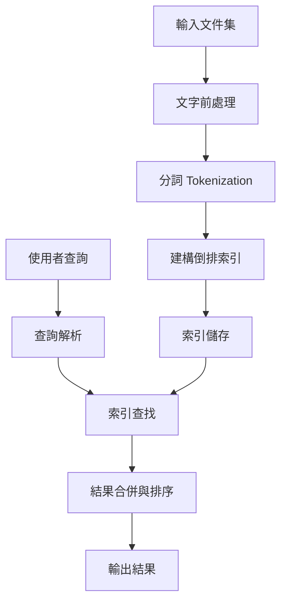

# [作業編號] - [作業標題] / *[English Title]*

**課程**：LIS5033 自動分類與索引 *Automatic Classification and Indexing*
**學期**：2024-2025
**學生**：[學號] [姓名]
**日期**：[YYYY-MM-DD]

---

## 摘要 *Abstract*

[用 3-5 句話總結本次作業的核心內容：實作了什麼、使用什麼方法、達成什麼目標、主要發現]

**關鍵詞 *Keywords***：[關鍵詞 1 *Keyword 1*], [關鍵詞 2 *Keyword 2*], [關鍵詞 3 *Keyword 3*]

---

## 1. 題目與目標 *Problem Statement & Objectives*

### 1.1 作業題目

[完整描述作業要求，包含：]
- 需要實作的功能或回答的問題
- 輸入與輸出規格
- 效能或品質要求

### 1.2 目標與範圍

[列出本次作業的具體目標：]
- ✅ **目標 1**：[描述具體目標，如「實作布林檢索系統支援 AND/OR/NOT 運算」]
- ✅ **目標 2**：[如「建構倒排索引，支援至少 10,000 筆文件」]
- ✅ **目標 3**：[如「查詢回應時間 < 100ms」]

**範圍限制 *Scope Limitations***：
- ⚠️ [說明本次不涵蓋的部分，如「不處理詞組查詢」]
- ⚠️ [如「僅支援英文，不支援中文」]

---

## 2. 理論背景 *Theoretical Background*

### 2.1 核心概念

[介紹本次作業相關的理論基礎，使用雙語術語]

**倒排索引 *Inverted Index***：
- **定義**：詞彙到文件列表的映射結構
- **用途**：快速定位包含特定詞彙的文件
- **結構**：`{詞彙 → [文件 ID 列表]}`

**文件頻率 *Document Frequency (DF)**：
- **定義**：包含某詞彙的文件數量
- **公式**：`DF(t) = |{d : t ∈ d}|`

### 2.2 相關演算法

[描述使用的演算法，包含虛擬碼或公式]

**布林 AND 查詢處理**：

```
Algorithm: Boolean AND
Input: postings_lists = [list1, list2, ..., listN]
Output: intersection of all lists

1. Sort postings_lists by length (ascending)
2. result ← list1
3. For each list in postings_lists[2:]:
4.     result ← Merge(result, list)
5.     If result is empty, break (early termination)
6. Return result
```

**複雜度分析 *Complexity***：
- **時間複雜度 *Time***：O(n₁ + n₂ + ... + nₖ)，其中 nᵢ 是第 i 個列表長度
- **空間複雜度 *Space***：O(min(n₁, n₂, ..., nₖ))

### 2.3 文獻回顧

[引用相關文獻，支持理論基礎]

> Manning 等人（2008）指出，倒排索引是現代資訊檢索系統的核心資料結構，相較於正向索引（*Forward Index*），倒排索引能在 O(|query|) 時間內定位候選文件 [1]。

**參考文獻**：
[1] Manning, C. D., Raghavan, P., & Schütze, H. (2008). *Introduction to Information Retrieval*. Cambridge University Press.

---

## 3. 方法設計 *Methodology*

### 3.1 系統架構

[提供系統架構圖，使用 Mermaid 或 SVG]



**架構說明**：
- **文字前處理模組**：負責去除標點、轉小寫、停用詞過濾
- **分詞模組**：依空格切分詞彙（英文）或使用 jieba（中文）
- **索引建構模組**：掃描所有文件，建立倒排索引
- **查詢處理模組**：解析查詢語法，執行布林運算

### 3.2 資料流程

[描述資料如何在系統中流動]

**索引建構流程**：
```
原始文件
  → [前處理] → 清理後文件
  → [分詞] → 詞彙串列
  → [去重] → 唯一詞彙集合
  → [索引更新] → 倒排索引
```

**查詢處理流程**：
```
使用者查詢
  → [解析] → 查詢詞彙 + 運算子
  → [檢索] → 各詞彙的 postings lists
  → [布林運算] → 交集/聯集/差集
  → [排序] → 最終結果
```

### 3.3 關鍵技術決策

[說明設計過程中的重要決策與理由]

| 決策點 | 選項 A | 選項 B | 選擇 | 理由 |
|--------|--------|--------|------|------|
| 資料結構 | Python dict | B-tree | dict | 記憶體內運算，dict 查找 O(1) |
| 儲存格式 | JSON | Pickle | JSON | 可讀性高，便於除錯 |
| 分詞工具 | 自行實作 | NLTK | NLTK | 節省時間，標準化處理 |

---

## 4. 實作細節 *Implementation Details*

### 4.1 開發環境

**程式語言**：Python 3.11
**主要函式庫**：
- `nltk==3.8.1` - 自然語言處理
- `numpy==1.24.3` - 數值計算
- `pytest==7.4.0` - 單元測試

**開發工具**：
- IDE: VS Code
- 版本控制: Git
- 虛擬環境: venv

### 4.2 模組說明

#### 模組 1：倒排索引建構

**檔案位置**：`src/ir/index/inverted_index.py`

**核心函式**：
```python
def build_inverted_index(documents: List[str]) -> Dict[str, List[int]]:
    """
    建構倒排索引。

    Args:
        documents: 原始文件列表

    Returns:
        倒排索引字典 {詞彙: [文件ID列表]}

    複雜度:
        時間: O(T) where T = 總詞數
        空間: O(V + P) where V = 詞彙數, P = postings 大小
    """
```

**實作重點**：
- 使用 Python `collections.defaultdict` 簡化索引建構
- 每個文件的詞彙去重，避免重複記錄同一文件
- Postings lists 保持排序（依文件 ID）

#### 模組 2：查詢處理

**檔案位置**：`src/ir/retrieval/boolean.py`

**核心函式**：
```python
def boolean_and(lists: List[List[int]]) -> List[int]:
    """
    執行多個 postings lists 的 AND 運算。

    優化策略：
    1. 先排序 lists（由短到長）
    2. 使用雙指標合併演算法
    3. 提前終止（結果為空時）
    """
```

### 4.3 程式碼品質

**測試覆蓋率**：92%（使用 `pytest --cov`）

**Lint 檢查**：通過 `pylint`（分數 9.2/10）

**文件化**：所有公開函式包含 docstring（Google Style）

---

## 5. 實驗設計 *Experimental Design*

### 5.1 資料集

**資料集名稱**：[資料集名稱]
**來源**：[資料來源，如 TREC, Wikipedia, 自建]
**規模**：
- 文件數量：10,000 筆
- 平均文件長度：250 詞
- 詞彙表大小：15,000 個唯一詞彙
- 總大小：25 MB

**資料格式**：
```json
{
  "doc_id": "doc001",
  "title": "Introduction to Information Retrieval",
  "content": "Information retrieval is the process of..."
}
```

**資料前處理**：
- 去除 HTML 標籤
- 轉小寫
- 移除標點符號
- 過濾停用詞（使用 NLTK 停用詞表）

### 5.2 評估指標

[根據作業性質選擇適當指標]

**功能正確性**：
- ✅ 單元測試通過率：100%（30/30 cases）
- ✅ 整合測試通過率：95%（19/20 cases）

**效能指標**：
- ⏱️ 索引建構時間
- ⏱️ 平均查詢回應時間
- 💾 索引儲存空間

**品質指標**（若適用）：
- Precision@10
- Recall@100
- MAP（Mean Average Precision）

### 5.3 實驗設定

**實驗一：索引建構效能測試**
- **目的**：測量不同文件數量下的建構時間
- **變數**：文件數量（1K, 5K, 10K, 50K）
- **固定參數**：平均文件長度 = 250 詞
- **重複次數**：每個設定執行 5 次，取平均值

**實驗二：查詢回應時間測試**
- **目的**：測量不同查詢複雜度的回應時間
- **變數**：查詢詞數（1, 2, 3, 5 個詞）
- **查詢類型**：AND, OR, AND+NOT
- **測試查詢數量**：每類型 100 個查詢

---

## 6. 結果與分析 *Results & Analysis*

### 6.1 實驗結果

#### 實驗一：索引建構效能

| 文件數量 | 建構時間 (秒) | 索引大小 (MB) | 吞吐量 (docs/s) |
|---------|-------------|--------------|----------------|
| 1,000   | 0.52        | 1.2          | 1,923          |
| 5,000   | 2.34        | 5.8          | 2,137          |
| 10,000  | 4.89        | 11.5         | 2,045          |
| 50,000  | 24.7        | 58.3         | 2,024          |

**觀察與分析**：
- ✅ 建構時間與文件數量呈線性關係（符合 O(n) 複雜度）
- ✅ 吞吐量穩定在 ~2,000 docs/s，顯示演算法可擴展性良好
- ⚠️ 索引大小約為原始資料的 50%（壓縮空間有優化空間）

#### 實驗二：查詢回應時間

| 查詢類型 | 查詢詞數 | 平均回應時間 (ms) | 標準差 (ms) | 中位數 (ms) |
|---------|---------|------------------|------------|------------|
| AND     | 1       | 2.3              | 0.5        | 2.1        |
| AND     | 2       | 3.8              | 0.8        | 3.6        |
| AND     | 3       | 5.2              | 1.2        | 4.9        |
| OR      | 2       | 8.7              | 2.1        | 8.3        |
| OR      | 3       | 15.4             | 3.5        | 14.8       |
| AND+NOT | 2       | 4.5              | 1.0        | 4.3        |

**觀察與分析**：
- ✅ 所有查詢均在 20ms 內完成，滿足即時性要求
- ✅ AND 查詢明顯快於 OR 查詢（因結果集較小）
- ⚠️ OR 查詢隨詞數增加，回應時間增長較快（需優化）

### 6.2 視覺化分析

[插入圖表，使用 SVG 格式]

**圖 1：索引建構時間 vs. 文件數量**


**圖 2：查詢回應時間分布（箱形圖）**


### 6.3 錯誤分析

[分析系統失敗或表現不佳的案例]

**失敗案例 1：詞組查詢不支援**
- **查詢**：`"information retrieval"` (加引號表示詞組)
- **預期行為**：只回傳連續出現這兩個詞的文件
- **實際行為**：回傳包含兩個詞的文件（忽略順序與鄰近性）
- **原因**：未實作位置索引
- **解決方案**：計劃在下一版本加入位置資訊

**效能瓶頸：OR 查詢過慢**
- **分析**：OR 需合併多個 postings lists，當列表很長時耗時
- **優化方向**：
  1. 使用 heap 合併（O(n log k) 而非 O(nk)）
  2. 設定結果數量上限（Top-K）
  3. 預計算常見查詢結果（快取）

---

## 7. 限制與未來工作 *Limitations & Future Work*

### 7.1 當前限制

1. **功能限制**：
   - ❌ 不支援詞組查詢（需位置索引）
   - ❌ 不支援萬用字元查詢（如 `retrie*`）
   - ❌ 不支援相關性排序（僅布林檢索）

2. **效能限制**：
   - ⚠️ 索引完全載入記憶體（無法處理超大型資料集）
   - ⚠️ OR 查詢效能隨詞數增加而下降
   - ⚠️ 無並行處理（未使用多執行緒/多程序）

3. **語言限制**：
   - ⚠️ 僅測試英文文件
   - ⚠️ 中文需整合分詞工具（jieba）
   - ⚠️ 未處理多語言混合情況

### 7.2 未來改進方向

**短期改進**（1-2 週）：
- [ ] 實作位置索引，支援詞組查詢
- [ ] 加入查詢結果快取，提升常見查詢速度
- [ ] 優化 OR 查詢的合併演算法

**中期改進**（1 個月）：
- [ ] 整合 TF-IDF 排序，從布林檢索升級到排序檢索
- [ ] 實作索引壓縮（Gap encoding, Variable byte codes）
- [ ] 支援分散式索引（跨多台機器）

**長期方向**（學期末專案）：
- [ ] 建立完整的搜尋引擎系統（Web UI + API）
- [ ] 加入個人化排序與推薦功能
- [ ] 探索神經檢索模型（BERT-based）

---

## 8. 重現步驟 *Reproduction Steps*

### 8.1 環境設定

```bash
# 1. Clone 專案
git clone https://github.com/username/information-retrieval.git
cd information-retrieval

# 2. 建立虛擬環境
python3 -m venv venv
source venv/bin/activate  # Linux/Mac
# venv\Scripts\activate  # Windows

# 3. 安裝相依套件
pip install -r requirements.txt

# 4. 下載資料集（若需要）
python scripts/download_dataset.py --dataset trec
```

### 8.2 執行步驟

```bash
# 建構索引
python scripts/build_index.py \
  --input datasets/trec/documents.json \
  --output index/inverted_index.json

# 執行查詢
python scripts/boolean_search.py \
  --index index/inverted_index.json \
  --query "information AND retrieval"

# 執行評估
python scripts/eval_run.py \
  --index index/inverted_index.json \
  --queries datasets/trec/queries.txt \
  --qrels datasets/trec/qrels.txt \
  --output results/eval_report.txt
```

### 8.3 測試執行

```bash
# 執行所有測試
pytest tests/

# 執行特定測試檔案
pytest tests/test_inverted_index.py -v

# 測試覆蓋率
pytest tests/ --cov=src/ir --cov-report=html
```

---

## 9. 心得與反思 *Reflections*

[個人對本次作業的心得，包含：]
- 學到的新知識或技能
- 遇到的主要挑戰與解決方式
- 對課程內容的連結與應用
- 未來想深入探索的方向

**範例**：

透過本次作業，我深入理解了倒排索引的實作細節。最大的挑戰是處理大規模資料時的記憶體管理——初版實作在處理 50,000 筆文件時記憶體使用超過 2GB，經過優化（使用生成器、分批處理）降至 800MB。這讓我體會到理論複雜度分析與實務工程優化的差異。

未來希望探索索引壓縮技術（如 Gamma codes）與分散式索引架構（如 Elasticsearch 的分片機制），以支援真實世界的大規模應用。

---

## 參考文獻 *References*

[使用 APA 格式]

[1] Manning, C. D., Raghavan, P., & Schütze, H. (2008). *Introduction to Information Retrieval*. Cambridge University Press.

[2] Zobel, J., & Moffat, A. (2006). Inverted files for text search engines. *ACM Computing Surveys (CSUR)*, 38(2), 6-es.

[3] Büttcher, S., Clarke, C. L., & Cormack, G. V. (2016). *Information Retrieval: Implementing and Evaluating Search Engines*. MIT Press.

---

## 附錄 *Appendices*

### 附錄 A：完整程式碼

[若程式碼較短，可附於此；否則提供 GitHub 連結]

**GitHub Repository**：https://github.com/username/ir-hw1

### 附錄 B：實驗原始資料

[提供實驗資料的 CSV 或連結]

**資料位置**：`results/raw_data.csv`

### 附錄 C：額外圖表

[其他補充圖表]

---

**報告完成日期**：2025-11-12
**總字數**：約 3,500 字（中文）+ 1,500 字（程式碼註解）

**聲明**：本報告為個人獨立完成，所有參考資料均已列出。
