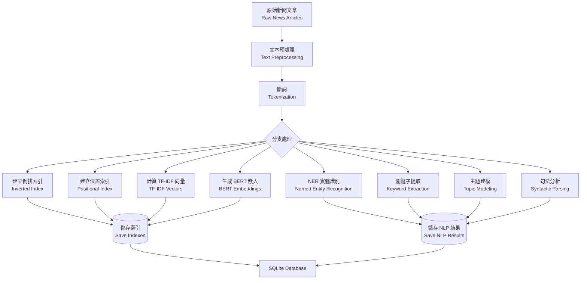
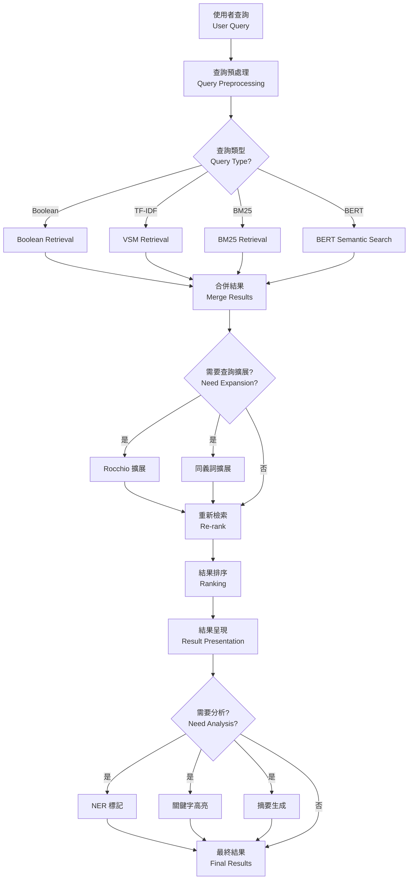
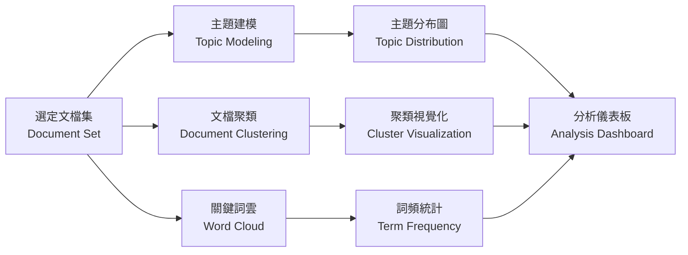
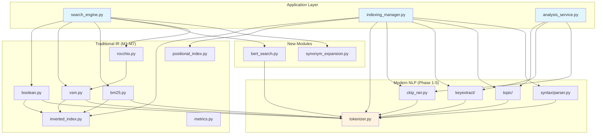

# 系統架構文件 (System Architecture Document)

**中文新聞智能檢索系統 (CNIRS)**
**Chinese News Intelligent Retrieval System**

---

## 目錄 (Table of Contents)

1. [系統概述](#1-系統概述-system-overview)
2. [整體架構](#2-整體架構-overall-architecture)
3. [核心模組設計](#3-核心模組設計-core-module-design)
4. [資料流設計](#4-資料流設計-data-flow-design)
5. [API 設計](#5-api-設計-api-design)
6. [模組相依性](#6-模組相依性-module-dependencies)
7. [部署架構](#7-部署架構-deployment-architecture)
8. [效能考量](#8-效能考量-performance-considerations)
9. [擴展性設計](#9-擴展性設計-scalability-design)
10. [安全性設計](#10-安全性設計-security-design)

---

## 1. 系統概述 (System Overview)

### 1.1 設計目標

CNIRS 旨在建立一個**整合傳統資訊檢索與現代自然語言處理技術**的中文新聞檢索系統，提供：

- **多模型檢索比較**: Boolean、TF-IDF、BM25、BERT Semantic Search
- **進階 NLP 分析**: NER、主題建模、關鍵字提取、句法分析
- **查詢優化**: Rocchio 演算法、同義詞擴展、語義擴展
- **智能摘要與聚類**: 自動摘要、文檔聚類、主題發現
- **雙介面支援**: CLI 命令列工具 + Web 視覺化介面

### 1.2 技術棧 (Technology Stack)

| 層級 (Layer) | 技術 (Technology) |
|-------------|------------------|
| **程式語言** | Python 3.10+ |
| **Web 框架** | Flask / FastAPI |
| **資料庫** | SQLite (開發), PostgreSQL (生產) |
| **前端** | Bootstrap 5, Chart.js, Plotly.js |
| **部署** | Docker, Gunicorn/Uvicorn |
| **CI/CD** | GitHub Actions |

### 1.3 系統規模

- **資料量**: 30,000 - 50,000 篇新聞文章
- **查詢響應時間**: < 1 秒 (Boolean/TF-IDF), < 3 秒 (BERT)
- **並發用戶**: 10-50 (中小型學術/教育環境)
- **儲存需求**: ~5-10 GB (原始資料 + 索引 + 模型)

---

## 2. 整體架構 (Overall Architecture)

### 2.1 四層架構 (Four-Tier Architecture)

```
┌─────────────────────────────────────────────────────────────┐
│                   使用者介面層                                 │
│            User Interface Layer (CLI + Web UI)               │
│  ┌──────────────┐              ┌────────────────────────┐   │
│  │  CLI Tools   │              │  Web Dashboard (Flask) │   │
│  │  - search.py │              │  - Search Page         │   │
│  │  - index.py  │              │  - Analysis Page       │   │
│  │  - analyze.py│              │  - Comparison Page     │   │
│  └──────────────┘              └────────────────────────┘   │
└─────────────────┬───────────────────────┬───────────────────┘
                  │ Function Call         │ HTTP REST API
┌─────────────────▼───────────────────────▼───────────────────┐
│                   應用邏輯層                                   │
│          Application Logic Layer (Flask/FastAPI)            │
│  ┌──────────────────────────────────────────────────────┐   │
│  │  Search Engine (search_engine.py)                    │   │
│  │  - Query Parser                                       │   │
│  │  - Result Aggregator                                  │   │
│  │  - Model Comparator                                   │   │
│  └──────────────────────────────────────────────────────┘   │
│  ┌──────────────────────────────────────────────────────┐   │
│  │  Indexing Manager (indexing_manager.py)              │   │
│  │  - Index Builder                                      │   │
│  │  - Document Preprocessor                              │   │
│  └──────────────────────────────────────────────────────┘   │
│  ┌──────────────────────────────────────────────────────┐   │
│  │  Analysis Service (analysis_service.py)              │   │
│  │  - NLP Pipeline                                       │   │
│  │  - Topic Analysis                                     │   │
│  │  - Clustering Service                                 │   │
│  └──────────────────────────────────────────────────────┘   │
└─────────────────┬───────────────────────────────────────────┘
                  │ Module API Calls
┌─────────────────▼───────────────────────────────────────────┐
│                   IR 核心層                                    │
│      IR Core Layer (Traditional IR + Modern NLP)            │
│  ┌──────────────────────┐  ┌────────────────────────────┐   │
│  │  Traditional IR (M1-7)│  │  Modern NLP (Phase 1-5)   │   │
│  ├──────────────────────┤  ├────────────────────────────┤   │
│  │ • Boolean Retrieval  │  │ • Tokenization (Jieba)    │   │
│  │ • Inverted Index     │  │ • NER (CKIP)              │   │
│  │ • Positional Index   │  │ • Keyword Extract         │   │
│  │ • TF-IDF, BM25       │  │   - TextRank, YAKE        │   │
│  │ • VSM, Cosine Sim    │  │   - KeyBERT, RAKE         │   │
│  │ • Rocchio            │  │ • Topic Modeling          │   │
│  │ • Evaluation Metrics │  │   - LDA, BERTopic         │   │
│  │ • Clustering         │  │ • Pattern Mining (PAT)    │   │
│  │ • Summarization      │  │ • Syntax Parsing (SuPar)  │   │
│  └──────────────────────┘  └────────────────────────────┘   │
│  ┌──────────────────────────────────────────────────────┐   │
│  │  New Modules (To be implemented)                     │   │
│  │  • BM25 Retrieval                                     │   │
│  │  • BERT Semantic Search (sentence-transformers)      │   │
│  │  • Query Expansion (Synonym + Semantic)              │   │
│  └──────────────────────────────────────────────────────┘   │
└─────────────────┬───────────────────────────────────────────┘
                  │ Data Access
┌─────────────────▼───────────────────────────────────────────┐
│                   資料儲存層                                   │
│            Data Storage Layer (SQLite + Models)             │
│  ┌──────────────────────────────────────────────────────┐   │
│  │  Database (SQLite)                                    │   │
│  │  - news (documents, metadata, preprocessed fields)   │   │
│  │  - indexes (inverted_index, positional_index)        │   │
│  │  - topics (topic_models, document_topics)            │   │
│  │  - queries (query_log, feedback_log)                 │   │
│  └──────────────────────────────────────────────────────┘   │
│  ┌──────────────────────────────────────────────────────┐   │
│  │  File Storage (Pickle/JSON)                          │   │
│  │  - Inverted Index (pickle)                            │   │
│  │  - TF-IDF Vectors (pickle)                            │   │
│  │  - BERT Embeddings (numpy/h5py)                      │   │
│  │  - LDA/BERTopic Models (pickle)                      │   │
│  └──────────────────────────────────────────────────────┘   │
│  ┌──────────────────────────────────────────────────────┐   │
│  │  Model Cache (Hugging Face)                          │   │
│  │  - CKIP NER Models (ckiplab/bert-base-chinese-ner)  │   │
│  │  - Sentence Transformers (paraphrase-multilingual)  │   │
│  │  - SuPar Dependency Parser (biaffine-dep-zh)        │   │
│  └──────────────────────────────────────────────────────┘   │
└─────────────────────────────────────────────────────────────┘
```

### 2.2 架構設計原則

| 原則 | 說明 |
|-----|------|
| **模組化** | 每個 IR/NLP 模組獨立可測試，透過統一 API 互動 |
| **可擴展性** | 新增檢索模型/NLP 工具無需修改核心架構 |
| **高內聚低耦合** | 模組內部功能專一，模組間依賴最小化 |
| **快取優化** | 索引、嵌入向量、模型預測結果皆可快取 |
| **錯誤隔離** | 單一模組失效不影響其他模組運作 |

---

## 3. 核心模組設計 (Core Module Design)

### 3.1 傳統 IR 模組 (Traditional IR Modules - M1-M7)

#### M1: Boolean Retrieval (布林檢索)

**模組**: `src/ir/retrieval/boolean.py`

**核心類別**:
```python
class BooleanRetrieval:
    def __init__(self, inverted_index: InvertedIndex)
    def search(self, query: str) -> List[int]  # Returns doc IDs
    def _parse_query(self, query: str) -> QueryTree
    def _execute_and(self, term1: str, term2: str) -> Set[int]
    def _execute_or(self, term1: str, term2: str) -> Set[int]
    def _execute_not(self, term: str, all_docs: Set[int]) -> Set[int]
```

**複雜度**:
- 建立索引: O(T) where T = total tokens
- AND 查詢: O(n1 + n2) where n1, n2 = posting list lengths
- OR 查詢: O(n1 + n2)

**依賴**:
- `InvertedIndex` (M2)
- `Tokenizer` (Phase 1)

---

#### M2: Inverted Index (倒排索引)

**模組**: `src/ir/index/inverted_index.py`

**核心類別**:
```python
class InvertedIndex:
    def __init__(self)
    def build(self, documents: List[Document]) -> None
    def get_postings(self, term: str) -> List[Tuple[int, int]]  # (doc_id, freq)
    def get_document_frequency(self, term: str) -> int
    def get_term_frequency(self, term: str, doc_id: int) -> int
    def save(self, filepath: str) -> None
    def load(self, filepath: str) -> None
```

**資料結構**:
```python
{
    "term1": [(doc_id1, freq1), (doc_id2, freq2), ...],
    "term2": [(doc_id3, freq3), ...],
    ...
}
```

**複雜度**:
- 建立: O(T)
- 查詢單一詞彙: O(1) average
- 空間: O(U + P) where U = unique terms, P = postings size

---

#### M3: Positional Index (位置索引)

**模組**: `src/ir/index/positional_index.py`

**核心類別**:
```python
class PositionalIndex:
    def __init__(self)
    def build(self, documents: List[Document]) -> None
    def get_postings(self, term: str) -> Dict[int, List[int]]  # {doc_id: [pos1, pos2, ...]}
    def phrase_query(self, phrase: str) -> List[int]  # Returns doc IDs
    def proximity_query(self, term1: str, term2: str, k: int) -> List[int]
```

**資料結構**:
```python
{
    "term1": {
        doc_id1: [pos1, pos2, pos3, ...],
        doc_id2: [pos1, ...],
        ...
    },
    ...
}
```

**複雜度**:
- Phrase query: O(min(n1, n2) * m) where m = avg positions per doc
- 空間: O(T) - 儲存所有位置

---

#### M4: Vector Space Model (向量空間模型)

**模組**: `src/ir/retrieval/vsm.py`

**核心類別**:
```python
class VectorSpaceModel:
    def __init__(self, index: InvertedIndex, num_docs: int)
    def compute_tfidf_vectors(self, documents: List[Document]) -> np.ndarray
    def compute_query_vector(self, query: str) -> np.ndarray
    def cosine_similarity(self, vec1: np.ndarray, vec2: np.ndarray) -> float
    def search(self, query: str, top_k: int = 10) -> List[Tuple[int, float]]
```

**TF-IDF 計算**:
```python
# TF (Term Frequency)
tf(t, d) = 1 + log10(freq(t, d))  if freq > 0 else 0

# IDF (Inverse Document Frequency)
idf(t) = log10(N / df(t))

# TF-IDF
tfidf(t, d) = tf(t, d) * idf(t)
```

**複雜度**:
- 計算文檔向量: O(D * U) where D = docs, U = unique terms
- 查詢: O(U + k log k) for top-k retrieval

---

#### M5: BM25 Retrieval (待實作)

**模組**: `src/ir/retrieval/bm25.py`

**核心類別**:
```python
class BM25Retrieval:
    def __init__(self, index: InvertedIndex, k1: float = 1.5, b: float = 0.75)
    def compute_bm25_score(self, term: str, doc_id: int) -> float
    def search(self, query: str, top_k: int = 10) -> List[Tuple[int, float]]
```

**BM25 公式**:
```python
BM25(q, d) = Σ IDF(qi) * [ f(qi, d) * (k1 + 1) ] /
                           [ f(qi, d) + k1 * (1 - b + b * |d|/avgdl) ]

# where:
# f(qi, d) = term frequency in doc
# |d| = document length
# avgdl = average document length
# k1, b = tuning parameters
```

**複雜度**: 同 VSM, O(U + k log k)

---

#### M6: Rocchio Query Expansion (查詢擴展)

**模組**: `src/ir/ranking/rocchio.py`

**核心類別**:
```python
class RocchioExpansion:
    def __init__(self, alpha: float = 1.0, beta: float = 0.75, gamma: float = 0.15)
    def expand_query(self, original_query: np.ndarray,
                     relevant_docs: List[np.ndarray],
                     non_relevant_docs: List[np.ndarray]) -> np.ndarray
    def pseudo_relevance_feedback(self, query: str, top_k: int = 10) -> str
```

**Rocchio 公式**:
```python
Q_new = α * Q_original + β * (1/|Dr|) * Σ d_rel - γ * (1/|Dn|) * Σ d_non_rel
```

**複雜度**: O(V) where V = vocabulary size

---

#### M7: Evaluation Metrics (評估指標)

**模組**: `src/ir/eval/metrics.py`

**核心函式**:
```python
def precision_at_k(retrieved: List[int], relevant: Set[int], k: int) -> float
def recall_at_k(retrieved: List[int], relevant: Set[int], k: int) -> float
def average_precision(retrieved: List[int], relevant: Set[int]) -> float
def mean_average_precision(results: Dict[str, List[int]], qrels: Dict[str, Set[int]]) -> float
def ndcg_at_k(retrieved: List[int], relevance_scores: Dict[int, int], k: int) -> float
```

**複雜度**: O(k) for P@k, R@k; O(n) for AP; O(n log n) for nDCG

---

### 3.2 現代 NLP 模組 (Modern NLP Modules - Phase 1-5)

#### Phase 1: Chinese Tokenization (中文斷詞)

**模組**: `src/ir/text/tokenizer.py`

**核心類別**:
```python
class ChineseTokenizer:
    def __init__(self, engine: str = 'jieba')  # jieba, ckip, pkuseg
    def tokenize(self, text: str) -> List[str]
    def tokenize_batch(self, texts: List[str]) -> List[List[str]]
    def add_custom_words(self, words: List[str]) -> None
```

**支援引擎**:
- **Jieba**: 快速、輕量 (預設)
- **CKIP**: 學術級、準確度高
- **PKUSeg**: 多領域支援

**複雜度**: O(n) where n = text length

---

#### Phase 2: Named Entity Recognition (命名實體識別)

**模組**: `src/ir/ner/ckip_ner.py`

**核心類別**:
```python
class CKIPEntityRecognizer:
    def __init__(self, model_name: str = "ckiplab/bert-base-chinese-ner")
    def recognize(self, text: str) -> List[Entity]
    def recognize_batch(self, texts: List[str]) -> List[List[Entity]]
    def filter_by_type(self, entities: List[Entity], entity_type: str) -> List[Entity]
```

**Entity 類別**:
```python
@dataclass
class Entity:
    text: str
    type: str  # PERSON, LOCATION, ORGANIZATION, DATE, etc.
    start: int
    end: int
    confidence: float
```

**複雜度**: O(n²) due to BERT model

---

#### Phase 3: Keyword Extraction (關鍵字提取)

**模組**: `src/ir/keyextract/`

**核心類別**:
```python
class TextRankExtractor:
    def extract(self, text: str, top_k: int = 10) -> List[Tuple[str, float]]

class YAKEExtractor:
    def extract(self, text: str, top_k: int = 10) -> List[Tuple[str, float]]

class KeyBERTExtractor:
    def extract(self, text: str, top_k: int = 10) -> List[Tuple[str, float]]

class RAKEExtractor:
    def extract(self, text: str, top_k: int = 10) -> List[Tuple[str, float]]
```

**2025 新增功能**:
- **位置權重 (Position Weighting)**: 標題、首段詞彙加權
- **NER 實體增強 (NER Entity Boosting)**: 實體詞得分提升 30%
- **多演算法融合 (Ensemble)**: 4 種演算法結果加權平均

**複雜度**:
- TextRank: O(V² + E) for graph construction
- YAKE: O(n)
- KeyBERT: O(n²) due to BERT
- RAKE: O(n)

---

#### Phase 4: Topic Modeling (主題建模)

**模組**: `src/ir/topic/`

**核心類別**:
```python
class LDATopicModel:
    def __init__(self, num_topics: int = 10, alpha: float = 0.1, beta: float = 0.01)
    def fit(self, documents: List[List[str]]) -> None
    def transform(self, document: List[str]) -> List[Tuple[int, float]]
    def get_topic_words(self, topic_id: int, top_k: int = 10) -> List[Tuple[str, float]]

class BERTopicModel:
    def __init__(self, embedding_model: str = "paraphrase-multilingual-MiniLM-L12-v2")
    def fit(self, documents: List[str]) -> None
    def transform(self, document: str) -> Tuple[int, float]
    def get_topic_info(self) -> pd.DataFrame
```

**LDA 特點**:
- 機率生成模型 (Probabilistic Generative Model)
- 可解釋性高，訓練快速
- 適合傳統 IR 比較

**BERTopic 特點**:
- 基於 Transformer 嵌入 (Transformer-based Embeddings)
- 動態主題數量
- 更好的語義理解

**複雜度**:
- LDA: O(K * I * D) where K = topics, I = iterations, D = docs
- BERTopic: O(D * n²) for BERT + O(D log D) for HDBSCAN

---

#### Phase 5: Syntactic Parsing (句法分析)

**模組**: `src/ir/syntax/parser.py`

**核心類別**:
```python
class DependencyParser:
    def __init__(self, model_name: str = "biaffine-dep-zh")
    def parse(self, text: str) -> List[DependencyEdge]
    def get_dependency_tree(self, text: str) -> Dict[int, List[DependencyEdge]]
    def get_root_verb(self, edges: List[DependencyEdge]) -> Optional[str]

class SVOExtractor:
    def __init__(self, parser: DependencyParser)
    def extract(self, text: str, include_partial: bool = True) -> List[SVOTriple]
    def extract_all_relations(self, text: str) -> List[Tuple[str, str, str]]

class SyntaxAnalyzer:
    def analyze(self, text: str, extract_svo: bool = True) -> Dict
    def analyze_batch(self, texts: List[str]) -> List[Dict]
```

**應用場景**:
- **查詢理解**: 提取查詢的主語、動詞、賓語
- **文檔摘要**: 提取核心句子結構
- **關係抽取**: 識別實體間關係

**複雜度**: O(n³) for dependency parsing

---

### 3.3 新增模組 (New Modules - To be implemented)

#### BERT Semantic Search (語義搜尋)

**模組**: `src/ir/retrieval/bert_search.py`

**核心類別**:
```python
class BERTSemanticSearch:
    def __init__(self, model_name: str = "paraphrase-multilingual-MiniLM-L12-v2")
    def encode_documents(self, documents: List[str]) -> np.ndarray  # (N, 768)
    def encode_query(self, query: str) -> np.ndarray  # (768,)
    def search(self, query: str, top_k: int = 10) -> List[Tuple[int, float]]
    def batch_search(self, queries: List[str], top_k: int = 10) -> List[List[Tuple[int, float]]]
```

**技術細節**:
- 使用 `sentence-transformers` 庫
- 模型: `paraphrase-multilingual-MiniLM-L12-v2` (支援中文)
- 向量維度: 384 或 768
- 相似度: Cosine Similarity

**複雜度**:
- 編碼: O(n²) per document (BERT forward pass)
- 搜尋: O(D) for similarity computation, O(k log k) for top-k

**儲存**:
```python
# 使用 FAISS 加速 (可選)
import faiss

index = faiss.IndexFlatIP(768)  # Inner Product = Cosine Similarity (normalized)
index.add(embeddings)  # O(D)
distances, indices = index.search(query_embedding, top_k)  # O(log D)
```

---

#### Query Expansion with Synonyms (同義詞擴展)

**模組**: `src/ir/expansion/synonym_expansion.py`

**核心類別**:
```python
class SynonymExpansion:
    def __init__(self, synonym_dict_path: str = "data/synonyms.txt")
    def expand(self, query: str, max_synonyms: int = 3) -> str
    def get_synonyms(self, word: str) -> List[str]

class SemanticExpansion:
    def __init__(self, word2vec_model_path: str)
    def expand(self, query: str, top_k: int = 5, threshold: float = 0.7) -> str
    def find_similar_words(self, word: str, top_k: int = 5) -> List[Tuple[str, float]]
```

**擴展策略**:
1. **基於字典**: 使用同義詞典 (如 HowNet)
2. **基於詞向量**: Word2Vec, FastText
3. **基於 BERT**: Masked Language Model 預測

**範例**:
```
原查詢: "機器學習"
擴展後: "機器學習 OR 深度學習 OR 人工智慧 OR AI"
```

---

## 4. 資料流設計 (Data Flow Design)

### 4.1 索引建立流程 (Indexing Pipeline)



**流程說明**:

1. **文本預處理** (Preprocessing):
   - 移除 HTML 標籤
   - 統一編碼 (UTF-8)
   - 去除特殊符號 (保留中文、英文、數字)

2. **斷詞** (Tokenization):
   - 使用 Jieba (預設) 或 CKIP
   - 儲存 `tokens_title`, `tokens_content` 至 DB

3. **平行處理** (Parallel Processing):
   - 索引建立與 NLP 分析可平行執行
   - 使用 multiprocessing 加速

4. **儲存策略**:
   - 小型資料 (metadata): SQLite TEXT/JSON
   - 大型資料 (vectors, embeddings): Pickle/HDF5
   - 模型檔案: Hugging Face cache

---

### 4.2 查詢處理流程 (Query Processing Pipeline)



**流程說明**:

1. **查詢預處理**:
   - 斷詞
   - 去除停用詞 (可選)
   - 識別查詢意圖 (Boolean operators, phrase queries)

2. **多模型檢索**:
   - 傳統 IR: Boolean, TF-IDF, BM25
   - 現代 NLP: BERT Semantic Search
   - 可選擇單一模型或多模型比較

3. **查詢擴展**:
   - 自動觸發 (Pseudo-relevance feedback)
   - 手動觸發 (使用者選擇相關文檔)

4. **結果後處理**:
   - NER 實體高亮
   - 關鍵字摘要
   - 主題標籤

---

### 4.3 分析流程 (Analysis Pipeline)



---

## 5. API 設計 (API Design)

### 5.1 RESTful API 規範

**Base URL**: `http://localhost:5000/api/v1`

#### 5.1.1 搜尋 API (Search API)

**POST /search**

Request:
```json
{
  "query": "人工智慧發展",
  "models": ["boolean", "tfidf", "bm25", "bert"],
  "top_k": 10,
  "filters": {
    "date_from": "2023-01-01",
    "date_to": "2024-12-31",
    "category": "科技",
    "source": "中央社"
  },
  "expansion": {
    "enabled": true,
    "methods": ["rocchio", "synonym"]
  }
}
```

Response:
```json
{
  "query": {
    "original": "人工智慧發展",
    "expanded": "人工智慧發展 OR AI OR 機器學習 OR 深度學習",
    "tokens": ["人工智慧", "發展"]
  },
  "results": {
    "boolean": {
      "count": 127,
      "time": 0.05,
      "documents": [
        {
          "doc_id": 123,
          "title": "AI 技術突破...",
          "snippet": "...人工智慧發展迅速...",
          "score": 1.0,
          "publish_date": "2024-03-15",
          "source": "中央社",
          "url": "https://..."
        }
      ]
    },
    "tfidf": {
      "count": 127,
      "time": 0.12,
      "documents": [...]
    },
    "bm25": {
      "count": 127,
      "time": 0.15,
      "documents": [...]
    },
    "bert": {
      "count": 100,
      "time": 2.35,
      "documents": [...]
    }
  },
  "total_time": 2.67
}
```

---

#### 5.1.2 索引 API (Indexing API)

**POST /index/build**

Request:
```json
{
  "source": "upload",  // "upload", "crawl", "database"
  "documents": [
    {
      "title": "新聞標題",
      "content": "新聞內容...",
      "author": "記者名",
      "publish_date": "2024-03-15",
      "source": "中央社",
      "category": "科技",
      "url": "https://..."
    }
  ],
  "options": {
    "enable_ner": true,
    "enable_topic_modeling": true,
    "enable_keywords": true,
    "enable_syntax": false
  }
}
```

Response:
```json
{
  "status": "success",
  "indexed_count": 100,
  "failed_count": 0,
  "time": 45.3,
  "details": {
    "inverted_index": "built",
    "positional_index": "built",
    "tfidf_vectors": "computed",
    "bert_embeddings": "encoded",
    "ner_entities": "extracted",
    "topics": "modeled",
    "keywords": "extracted"
  }
}
```

---

#### 5.1.3 分析 API (Analysis API)

**GET /analysis/topics**

Response:
```json
{
  "topics": [
    {
      "topic_id": 0,
      "label": "人工智慧與科技",
      "top_words": [
        {"word": "AI", "weight": 0.045},
        {"word": "人工智慧", "weight": 0.038},
        {"word": "機器學習", "weight": 0.032}
      ],
      "document_count": 234,
      "sample_titles": ["...", "...", "..."]
    }
  ],
  "num_topics": 10,
  "model_type": "LDA"
}
```

---

**GET /analysis/clusters**

Response:
```json
{
  "clusters": [
    {
      "cluster_id": 0,
      "centroid_words": ["科技", "AI", "創新"],
      "document_ids": [12, 34, 56, ...],
      "size": 45
    }
  ],
  "num_clusters": 5,
  "silhouette_score": 0.68
}
```

---

#### 5.1.4 評估 API (Evaluation API)

**POST /evaluation/compare**

Request:
```json
{
  "queries": [
    {
      "query_id": "Q1",
      "text": "人工智慧",
      "relevant_docs": [12, 34, 56, 78]
    }
  ],
  "models": ["boolean", "tfidf", "bm25", "bert"],
  "metrics": ["MAP", "nDCG@10", "P@5", "R@10"]
}
```

Response:
```json
{
  "comparison": {
    "boolean": {
      "MAP": 0.45,
      "nDCG@10": 0.52,
      "P@5": 0.60,
      "R@10": 0.35
    },
    "tfidf": {
      "MAP": 0.68,
      "nDCG@10": 0.71,
      "P@5": 0.80,
      "R@10": 0.52
    },
    "bm25": {
      "MAP": 0.72,
      "nDCG@10": 0.75,
      "P@5": 0.85,
      "R@10": 0.58
    },
    "bert": {
      "MAP": 0.79,
      "nDCG@10": 0.82,
      "P@5": 0.90,
      "R@10": 0.65
    }
  },
  "best_model": "bert",
  "query_count": 50
}
```

---

### 5.2 CLI 命令列介面 (Command-Line Interface)

#### 5.2.1 搜尋命令

```bash
# 基本搜尋
python scripts/search.py --query "人工智慧" --model tfidf --top-k 10

# 多模型比較
python scripts/search.py --query "機器學習" --models boolean,tfidf,bm25,bert --compare

# 帶過濾條件
python scripts/search.py --query "科技創新" \
  --date-from 2023-01-01 --date-to 2024-12-31 \
  --category 科技 --source 中央社

# 查詢擴展
python scripts/search.py --query "AI發展" --expand rocchio --top-k 20
```

#### 5.2.2 索引命令

```bash
# 建立索引
python scripts/build_index.py --input data/news.json --output indexes/

# 增量索引
python scripts/build_index.py --input data/new_news.json --incremental

# 重建索引 (包含 NLP 處理)
python scripts/build_index.py --rebuild --enable-ner --enable-topics
```

#### 5.2.3 分析命令

```bash
# 主題分析
python scripts/analyze.py --task topics --num-topics 10 --model lda

# 聚類分析
python scripts/analyze.py --task clustering --num-clusters 5 --method kmeans

# 關鍵字雲
python scripts/analyze.py --task wordcloud --output wordcloud.png
```

#### 5.2.4 評估命令

```bash
# 評估單一模型
python scripts/evaluate.py --model tfidf --qrels data/qrels.txt --metrics MAP,nDCG@10,P@5

# 比較多模型
python scripts/evaluate.py --models boolean,tfidf,bm25,bert \
  --qrels data/qrels.txt --output evaluation_report.json
```

---

## 6. 模組相依性 (Module Dependencies)

### 6.1 依賴關係圖



### 6.2 核心依賴說明

| 模組 | 直接依賴 | 說明 |
|-----|---------|------|
| `boolean.py` | `inverted_index.py`, `tokenizer.py` | Boolean 檢索需要倒排索引和斷詞 |
| `vsm.py` | `inverted_index.py`, `tokenizer.py` | VSM 需要索引計算 IDF |
| `bm25.py` | `inverted_index.py`, `tokenizer.py` | BM25 需要文檔長度統計 |
| `bert_search.py` | `tokenizer.py`, `sentence-transformers` | BERT 需要預訓練模型 |
| `rocchio.py` | `vsm.py` | Rocchio 需要向量表示 |
| `ckip_ner.py` | `tokenizer.py`, `transformers` | NER 需要斷詞和 BERT 模型 |
| `keyextract/` | `tokenizer.py`, `ckip_ner.py` (可選) | 關鍵字提取可整合 NER |
| `topic/` | `tokenizer.py`, `gensim`, `bertopic` | 主題建模需要斷詞 |
| `syntax/parser.py` | `tokenizer.py`, `supar` | 句法分析需要斷詞和 SuPar 模型 |

### 6.3 第三方套件依賴

```python
# requirements.txt (核心依賴)
jieba>=0.42.1
pkuseg>=0.0.25
ckip-transformers>=1.0.0
transformers>=4.30.0
torch>=2.0.0
supar>=1.1.4
gensim>=4.3.0
bertopic>=0.16.0
sentence-transformers>=2.2.0
yake>=0.4.8
keybert>=0.8.0
flask>=3.0.0
numpy>=1.24.0
scipy>=1.10.0
scikit-learn>=1.3.0
pandas>=2.0.0
```

---

## 7. 部署架構 (Deployment Architecture)

### 7.1 Docker 容器化部署

```dockerfile
# Dockerfile
FROM python:3.10-slim

WORKDIR /app

# Install system dependencies
RUN apt-get update && apt-get install -y \
    build-essential \
    git \
    && rm -rf /var/lib/apt/lists/*

# Copy requirements
COPY requirements.txt .
RUN pip install --no-cache-dir -r requirements.txt

# Download models (cache)
RUN python -c "from transformers import AutoTokenizer, AutoModel; \
    AutoTokenizer.from_pretrained('ckiplab/bert-base-chinese-ner'); \
    AutoModel.from_pretrained('ckiplab/bert-base-chinese-ner')"

RUN python -c "from sentence_transformers import SentenceTransformer; \
    SentenceTransformer('paraphrase-multilingual-MiniLM-L12-v2')"

# Copy application code
COPY . .

# Expose port
EXPOSE 5000

# Run application
CMD ["gunicorn", "-w", "4", "-b", "0.0.0.0:5000", "app:app"]
```

```yaml
# docker-compose.yml
version: '3.8'

services:
  web:
    build: .
    ports:
      - "5000:5000"
    volumes:
      - ./data:/app/data
      - ./indexes:/app/indexes
      - ./logs:/app/logs
    environment:
      - FLASK_ENV=production
      - DATABASE_URL=sqlite:///data/cnirs.db
    depends_on:
      - db
    restart: unless-stopped

  db:
    image: postgres:15
    environment:
      - POSTGRES_USER=cnirs
      - POSTGRES_PASSWORD=secure_password
      - POSTGRES_DB=cnirs_db
    volumes:
      - postgres_data:/var/lib/postgresql/data
    restart: unless-stopped

  nginx:
    image: nginx:alpine
    ports:
      - "80:80"
      - "443:443"
    volumes:
      - ./nginx.conf:/etc/nginx/nginx.conf
      - ./ssl:/etc/nginx/ssl
    depends_on:
      - web
    restart: unless-stopped

volumes:
  postgres_data:
```

### 7.2 生產環境架構

```
Internet
    │
    ▼
┌─────────────────────┐
│  Nginx (Reverse     │
│  Proxy + SSL)       │
└──────────┬──────────┘
           │
    ┌──────▼──────┐
    │  Load       │
    │  Balancer   │
    └──────┬──────┘
           │
    ┌──────▼────────────────────────┐
    │                               │
┌───▼────────┐           ┌──────────▼───┐
│  Flask     │           │  Flask       │
│  Instance 1│           │  Instance 2  │
│  (Worker)  │           │  (Worker)    │
└───┬────────┘           └──────────┬───┘
    │                               │
    └──────────┬────────────────────┘
               │
    ┌──────────▼──────────┐
    │  PostgreSQL         │
    │  (Primary DB)       │
    └──────────┬──────────┘
               │
    ┌──────────▼──────────┐
    │  File Storage       │
    │  - Indexes (Pickle) │
    │  - Embeddings       │
    │  - Models Cache     │
    └─────────────────────┘
```

---

## 8. 效能考量 (Performance Considerations)

### 8.1 效能瓶頸分析

| 操作 | 時間複雜度 | 瓶頸 | 優化策略 |
|-----|----------|------|---------|
| **Boolean 檢索** | O(n1 + n2) | Posting list merge | 壓縮 posting lists |
| **TF-IDF 檢索** | O(U + k log k) | 向量計算 | 稀疏矩陣存儲 (scipy.sparse) |
| **BM25 檢索** | O(U + k log k) | 同 TF-IDF | 同上 |
| **BERT 檢索** | O(D) | 相似度計算 | 使用 FAISS 索引 |
| **BERT 編碼** | O(n²) | Transformer 計算 | GPU 加速, 批次處理 |
| **NER** | O(n²) | BERT forward pass | GPU 加速, 批次處理 |
| **主題建模 (LDA)** | O(K * I * D) | 迭代訓練 | 增量更新, 減少迭代次數 |
| **句法分析** | O(n³) | Dependency parsing | 限制句子長度, GPU 加速 |

### 8.2 快取策略 (Caching Strategy)

```python
# 1. 索引快取 (Index Caching)
class CachedInvertedIndex:
    def __init__(self, cache_size: int = 1000):
        self.lru_cache = LRUCache(cache_size)

    @lru_cache(maxsize=1000)
    def get_postings(self, term: str) -> List[Tuple[int, int]]:
        # Cache frequently accessed postings
        pass

# 2. 模型預測快取 (Model Prediction Caching)
class CachedBERTSearch:
    def __init__(self):
        self.embedding_cache = {}

    def encode_query(self, query: str) -> np.ndarray:
        if query in self.embedding_cache:
            return self.embedding_cache[query]
        embedding = self.model.encode(query)
        self.embedding_cache[query] = embedding
        return embedding

# 3. 查詢結果快取 (Query Result Caching)
from functools import lru_cache
import hashlib

def cache_search_results(ttl: int = 3600):
    def decorator(func):
        cache = {}

        def wrapper(query: str, **kwargs):
            cache_key = hashlib.md5(
                f"{query}{str(sorted(kwargs.items()))}".encode()
            ).hexdigest()

            if cache_key in cache:
                result, timestamp = cache[cache_key]
                if time.time() - timestamp < ttl:
                    return result

            result = func(query, **kwargs)
            cache[cache_key] = (result, time.time())
            return result

        return wrapper
    return decorator
```

### 8.3 批次處理優化

```python
# BERT 批次編碼
def batch_encode_documents(documents: List[str], batch_size: int = 32) -> np.ndarray:
    """Encode documents in batches to reduce overhead."""
    embeddings = []
    for i in range(0, len(documents), batch_size):
        batch = documents[i:i + batch_size]
        batch_embeddings = model.encode(batch, convert_to_numpy=True)
        embeddings.append(batch_embeddings)
    return np.vstack(embeddings)

# NER 批次處理
def batch_recognize_entities(texts: List[str], batch_size: int = 16) -> List[List[Entity]]:
    """Batch NER to reduce model loading overhead."""
    all_entities = []
    for i in range(0, len(texts), batch_size):
        batch = texts[i:i + batch_size]
        batch_entities = ner_model(batch)
        all_entities.extend(batch_entities)
    return all_entities
```

### 8.4 索引壓縮

```python
# Variable Byte Encoding for Posting Lists
def vb_encode(number: int) -> bytes:
    """Variable-byte encode a number."""
    bytes_list = []
    while True:
        bytes_list.insert(0, number % 128)
        if number < 128:
            break
        number = number // 128
    bytes_list[-1] += 128  # Set continuation bit
    return bytes(bytes_list)

def vb_decode(bytes_data: bytes) -> List[int]:
    """Decode variable-byte encoded data."""
    numbers = []
    current = 0
    for byte in bytes_data:
        if byte < 128:
            current = 128 * current + byte
        else:
            current = 128 * current + (byte - 128)
            numbers.append(current)
            current = 0
    return numbers

# Usage in Inverted Index
class CompressedInvertedIndex:
    def __init__(self):
        self.index = {}  # term -> vb_encoded_postings

    def add_postings(self, term: str, postings: List[int]):
        # Delta encoding + VB encoding
        deltas = [postings[0]] + [postings[i] - postings[i-1]
                                    for i in range(1, len(postings))]
        encoded = b''.join(vb_encode(d) for d in deltas)
        self.index[term] = encoded
```

---

## 9. 擴展性設計 (Scalability Design)

### 9.1 水平擴展 (Horizontal Scaling)

#### 分散式索引 (Distributed Indexing)

```python
# Shard documents by doc_id hash
def get_shard_id(doc_id: int, num_shards: int) -> int:
    return doc_id % num_shards

# Each shard maintains its own inverted index
class DistributedInvertedIndex:
    def __init__(self, num_shards: int = 4):
        self.shards = [InvertedIndex() for _ in range(num_shards)]
        self.num_shards = num_shards

    def add_document(self, doc_id: int, tokens: List[str]):
        shard_id = get_shard_id(doc_id, self.num_shards)
        self.shards[shard_id].add_document(doc_id, tokens)

    def search(self, term: str) -> List[Tuple[int, int]]:
        # Parallel search across shards
        results = []
        with ThreadPoolExecutor(max_workers=self.num_shards) as executor:
            futures = [executor.submit(shard.get_postings, term)
                       for shard in self.shards]
            for future in futures:
                results.extend(future.result())
        return sorted(results, key=lambda x: x[0])
```

#### 分散式 BERT 編碼

```python
# Use Ray for distributed encoding
import ray

@ray.remote
class BERTEncoder:
    def __init__(self, model_name: str):
        self.model = SentenceTransformer(model_name)

    def encode(self, documents: List[str]) -> np.ndarray:
        return self.model.encode(documents)

# Distributed encoding
def distributed_encode(documents: List[str], num_workers: int = 4) -> np.ndarray:
    ray.init()

    # Create workers
    workers = [BERTEncoder.remote("paraphrase-multilingual-MiniLM-L12-v2")
               for _ in range(num_workers)]

    # Split documents
    chunk_size = len(documents) // num_workers
    chunks = [documents[i:i+chunk_size]
              for i in range(0, len(documents), chunk_size)]

    # Parallel encode
    futures = [worker.encode.remote(chunk)
               for worker, chunk in zip(workers, chunks)]
    embeddings = ray.get(futures)

    ray.shutdown()
    return np.vstack(embeddings)
```

### 9.2 垂直擴展 (Vertical Scaling)

#### GPU 加速

```python
# Use GPU for BERT models
class GPUAcceleratedBERT:
    def __init__(self, model_name: str, device: str = "cuda"):
        self.device = torch.device(device if torch.cuda.is_available() else "cpu")
        self.model = SentenceTransformer(model_name, device=self.device)

    def encode(self, texts: List[str], batch_size: int = 64) -> np.ndarray:
        # Automatically uses GPU if available
        return self.model.encode(texts, batch_size=batch_size,
                                  convert_to_numpy=True,
                                  show_progress_bar=True)
```

#### 多執行緒/多程序

```python
from concurrent.futures import ProcessPoolExecutor

def parallel_tokenize(documents: List[str], num_workers: int = 4) -> List[List[str]]:
    """Parallelize tokenization across multiple processes."""
    with ProcessPoolExecutor(max_workers=num_workers) as executor:
        results = list(executor.map(jieba.lcut, documents))
    return results

def parallel_ner(documents: List[str], num_workers: int = 2) -> List[List[Entity]]:
    """Parallelize NER (limited by GPU)."""
    chunk_size = len(documents) // num_workers
    chunks = [documents[i:i+chunk_size]
              for i in range(0, len(documents), chunk_size)]

    with ProcessPoolExecutor(max_workers=num_workers) as executor:
        futures = [executor.submit(ner_model.recognize_batch, chunk)
                   for chunk in chunks]
        results = [entity for future in futures for entity in future.result()]
    return results
```

---

## 10. 安全性設計 (Security Design)

### 10.1 輸入驗證 (Input Validation)

```python
# Query sanitization
import re

def sanitize_query(query: str, max_length: int = 500) -> str:
    """Sanitize user query to prevent injection attacks."""
    # Limit length
    if len(query) > max_length:
        raise ValueError(f"Query too long (max {max_length} chars)")

    # Remove SQL injection patterns
    dangerous_patterns = [r"';", r"--", r"/\*", r"\*/", r"xp_", r"exec\s", r"union\s"]
    for pattern in dangerous_patterns:
        if re.search(pattern, query, re.IGNORECASE):
            raise ValueError("Invalid query: contains dangerous pattern")

    # Remove script tags (XSS prevention)
    query = re.sub(r'<script.*?>.*?</script>', '', query, flags=re.DOTALL | re.IGNORECASE)

    return query.strip()

# API rate limiting
from flask_limiter import Limiter
from flask_limiter.util import get_remote_address

limiter = Limiter(
    app,
    key_func=get_remote_address,
    default_limits=["200 per day", "50 per hour"]
)

@app.route('/api/v1/search', methods=['POST'])
@limiter.limit("10 per minute")
def search_api():
    # Rate-limited search endpoint
    pass
```

### 10.2 資料加密 (Data Encryption)

```python
# Encrypt sensitive fields in database
from cryptography.fernet import Fernet

class EncryptedDatabase:
    def __init__(self, key: bytes):
        self.cipher = Fernet(key)

    def encrypt_field(self, value: str) -> str:
        """Encrypt sensitive field (e.g., user email, API keys)."""
        return self.cipher.encrypt(value.encode()).decode()

    def decrypt_field(self, encrypted_value: str) -> str:
        """Decrypt field."""
        return self.cipher.decrypt(encrypted_value.encode()).decode()

# HTTPS only in production
app.config['SESSION_COOKIE_SECURE'] = True
app.config['SESSION_COOKIE_HTTPONLY'] = True
app.config['SESSION_COOKIE_SAMESITE'] = 'Lax'
```

### 10.3 存取控制 (Access Control)

```python
# Simple token-based authentication
from functools import wraps
from flask import request, jsonify

def require_api_key(f):
    @wraps(f)
    def decorated_function(*args, **kwargs):
        api_key = request.headers.get('X-API-Key')
        if not api_key or not validate_api_key(api_key):
            return jsonify({"error": "Invalid API key"}), 401
        return f(*args, **kwargs)
    return decorated_function

@app.route('/api/v1/index/build', methods=['POST'])
@require_api_key
def build_index_api():
    # Protected endpoint
    pass
```

---

## 總結 (Summary)

本系統架構文件詳細說明了 **中文新聞智能檢索系統 (CNIRS)** 的技術架構，包括：

1. **四層架構設計**: 使用者介面層 → 應用邏輯層 → IR 核心層 → 資料儲存層
2. **模組化設計**: 傳統 IR (M1-M7) + 現代 NLP (Phase 1-5) + 新增模組
3. **清晰的資料流**: 索引建立流程、查詢處理流程、分析流程
4. **完整的 API 設計**: RESTful API + CLI 工具
5. **效能優化策略**: 快取、批次處理、索引壓縮
6. **可擴展性**: 水平擴展 (分散式索引)、垂直擴展 (GPU 加速)
7. **安全性考量**: 輸入驗證、資料加密、存取控制

此架構設計遵循**高內聚低耦合**原則，確保系統的**可維護性、可擴展性、高效能**。

---

**文件版本**: v1.0
**最後更新**: 2025-11-13
**作者**: CNIRS 開發團隊
**授權**: Educational Use
